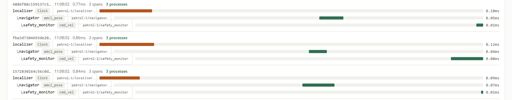
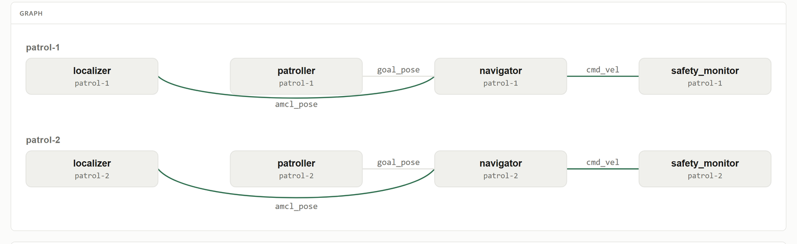
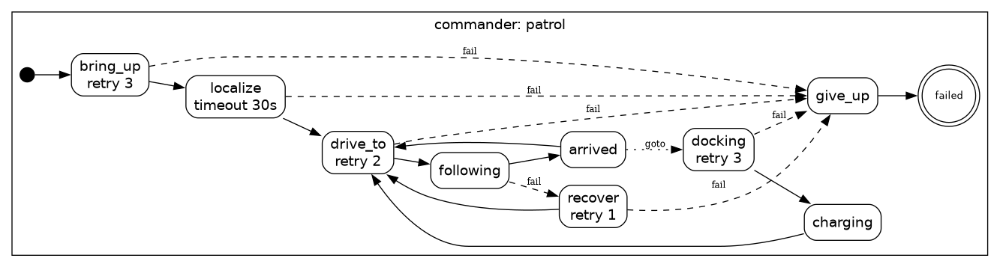

# Conductor

**Build ROS 2 applications, not ROS 2 plumbing.**

Conductor is an opinionated application framework for robotics, in Go, in the
spirit of [Encore](https://encore.dev): you declare *what your robot's nodes
do* in a small amount of typed, declarative code, and the framework derives
everything ROS 2 makes you hand-maintain — the communication graph, QoS
configuration, launch files, parameter files, lifecycle wiring, the task
state machine, the transform tree, and observability.

The core idea: **treat ROS 2 as a runtime, not a framework**, and make the
application graph a compile-time artifact. The canonical ROS failure — two
nodes silently not talking because of a QoS mismatch or a typo'd topic name,
discovered on the robot — becomes a build error.

## What it looks like

```go
//conductor:node
type Navigator struct {
    Pose     conductor.Sub[msgs.PoseStamped] `topic:"amcl_pose" qos:"reliable"`
    Cmd      conductor.Pub[msgs.Twist]       `topic:"cmd_vel"  qos:"reliable"`
    MaxSpeed conductor.Param[float64]        `name:"max_speed" default:"1.5"`
}

func (n *Navigator) OnPose(p msgs.PoseStamped) {
    // steer toward the goal; callbacks are single-threaded per node,
    // so plain struct fields are safe.
    n.Cmd.Publish(...)
}
```

```go
func main() {
    conductor.Run(&Localizer{}, &Patroller{}, &Navigator{}, &SafetyMonitor{})
}
```

From those declarations the `conductor` CLI statically derives the full topic
graph and checks it before anything runs:

```
$ conductor check examples/patrol
app patrol — 4 node(s), 5 topic(s), 3 external interface(s)
...
topics:
  amcl_pose   geometry_msgs/msg/PoseStamped   localizer -> navigator
  cmd_vel     geometry_msgs/msg/Twist         navigator -> safety_monitor,(external)
  estop       std_msgs/msg/Bool               (external) -> patroller,safety_monitor
  goal_pose   geometry_msgs/msg/PoseStamped   patroller -> navigator
  patrol_status patrol_msgs/msg/PatrolStatus  safety_monitor -> (external)

✓ graph valid: 0 errors, 0 warning(s)
```

Wiring mistakes fail the build with file:line positions:

```
error CND013: topic "battery": subscriber requests reliable delivery but
              publisher offers best-effort (app.go:26)
error CND010: topic "lidar": subscribed by monitor but nothing publishes it
error CND003: node monitor: missing handler method OnEstop (app.go:27)
```

## Try it

```sh
go test ./...                                # runtime + harness + scanner + graph tests
go run ./cmd/conductor check examples/patrol # validate the example app
go run ./cmd/conductor test examples/patrol  # validate it, then run its tests
go run ./cmd/conductor build examples/patrol # compile + emit gen/ artifacts
./examples/patrol/gen/bin/patrol             # run all nodes in-process (Ctrl-C to stop)
./examples/patrol/gen/bin/patrol -node navigator   # run a single node
```

Or through the [Makefile](Makefile), which wraps the same commands and knows
where the ROS overlay lives:

```sh
make            # list targets
make verify     # fmt + vet + tests + graph validation of every example
make check-envs # validate the example in each declared environment
make bundle     # build a deployable release bundle for the example
make interop    # the full matrix against real ROS 2 (needs .tools/env.sh)
make turtlesim  # the tutorial below, router and turtlesim_node included
```

`conductor build` emits, under `examples/patrol/gen/`:

- `patrol.launch.xml` — a ROS 2 launch file, one process per node
- `params.yaml` — ROS parameter file from the `Param` declarations; feed it
  back with `-params`, or overlay it per environment
- `graph.dot` — Graphviz view of the topic graph
- `bin/patrol` — the compiled app (one static binary; cross-compile with
  `GOOS`/`GOARCH` like any Go program)

## Concepts

| Declaration | Meaning |
|---|---|
| `//conductor:node` on a struct | The struct is a node (name: snake_case of the type) |
| `conductor.Sub[T]` + `OnField(T)` | Subscription with typed handler |
| `conductor.Pub[T]` | Publisher |
| `conductor.Param[T]` | Node parameter (`default:`, files, live `ros2 param set`) |
| `conductor.Timer` + `OnField()` | Periodic callback (`rate:"10hz"` or `rate:"250ms"`) |
| `conductor.Svc[Req,Res]` + `OnField(Req) (Res, error)` | Service server (`service:"name"`) |
| `conductor.Client[Req,Res]` + `.Call(req)` | Service client (`service:"name"`, optional `timeout:"3s"`) |
| `conductor.Action[G,F,R]` + `OnField(*Goal[G,F]) (R, error)` | Action server (`action:"name"`); handler runs one goroutine per goal |
| `conductor.ActionClient[G,F,R]` + `.SendGoal(g)` | Action client (`action:"name"`, optional `timeout:"60s"`) |
| `conductor.Mission` + `conductor.Step` + `OnField(*Task) error` | Task state machine (`start:`, `next:`, `fail:`, `timeout:`, `retry:`) |
| `conductor.TF` and `frame:"base_link"` on a Sub/Pub | Declared transform tree (`frames.json`); stamps and checks frame ids |
| `conductor.Lifecycle` + `.BringUp(ctx)` | Drive other managed nodes (`nodes:"a,b,c"`, in bringup order) |
| `robot.urdf` | Robot description; `conductor frames -from` derives `frames.json` from it |
| `conductor.Group` + `.State("ready")` | Planning group from the robot's SRDF (`group:"panda_arm"`), with its named joint configurations |
| `//ros:type pkg/msg/Name` on a struct | Maps a Go message type to its ROS interface |
| `conductor.json` | App name + topics provided/consumed by external ROS nodes |

QoS is expressed as intent-level profiles (`reliable`, `sensor`, `transient`)
rather than raw DDS knobs; the checker validates every pub/sub pairing.

Callbacks run on a single goroutine per node (mirroring a ROS single-threaded
executor), so node-local state needs no locking.

## Joining a live ROS 2 graph (zenoh transport)

Conductor apps can join a real ROS 2 graph as first-class peers of
`rmw_zenoh` nodes: same key expressions, CDR payloads, attachments, and
liveliness tokens, so `ros2 node list`, `ros2 topic list/info/echo` all see
conductor nodes natively — no bridge, no ROS installation linked into the
binary.

```sh
source .tools/env.sh                        # zenoh-c paths + rmw_zenoh overlay
go build -tags zenoh -o bin/patrol ./examples/patrol
./bin/patrol -transport zenoh               # connects to the router at tcp/127.0.0.1:7447
```

Verified end-to-end against ROS 2 Lyrical with rmw_zenoh 0.10:
`ros2 topic pub /chatter` → conductor subscriber, and conductor's navigator →
`ros2 topic echo /cmd_vel`, with correct type/hash/QoS shown by
`ros2 topic info --verbose`.

The transport is selected at runtime (`-transport inproc|zenoh`, plus
`-zenoh-endpoint`, `-domain`); the zenoh implementation links zenoh-c via
cgo and is gated behind the `zenoh` build tag, so plain `go build` needs no
native dependencies.

## Custom messages (`conductor msggen`)

Define interfaces as plain ROS `.msg` files and generate Go from them —
including the REP-2011 RIHS01 type hash, which conductor computes itself
(validated against all 692 message, service, and action types of a ROS 2
Lyrical install):

```sh
conductor msggen -out examples/patrol -pkg main -ros-pkg patrol_msgs examples/patrol/msg
```

emits structs with `//ros:type` directives (so `conductor check` sees them)
and `RegisterMessage` calls (so the zenoh transport can wire them). Standard
types referenced by your messages (e.g. `std_msgs/Header`) resolve via
`$AMENT_PREFIX_PATH`; `builtin_interfaces` Time/Duration map to Go
`time.Time`/`time.Duration`. Because the hash is computed locally, a custom
type needs no ROS package, no CMake, and no rebuild dance — `ros2 topic info
--verbose` on a live graph shows conductor's custom types with correct
type names and hashes.

## Services

Servers and clients are declared like everything else, with handlers that
run on the node's executor (state access is lock-free):

```go
Engage conductor.Svc[srvs.SetBoolRequest, srvs.SetBoolResponse] `service:"engage_estop"`

func (s *SafetyMonitor) OnEngage(req srvs.SetBoolRequest) (srvs.SetBoolResponse, error) { ... }
```

`conductor msggen` also parses `.srv` files — request/response structs plus
the service-level RIHS01 hash (which covers rosidl's synthesized `_Event`
type). Over zenoh, services are querier/queryable pairs in rmw_zenoh's wire
format, verified live in both directions: `ros2 service call` against a
conductor server, and a conductor `Client` calling an rclpy server. Graph
validation covers services too: a client whose service nothing serves, two
servers on one name, or a request/response type disagreement all fail
`conductor check`.

## Actions

An action server is one field and one method; conductor implements the full
ROS 2 action protocol (send_goal/cancel_goal/get_result services plus
feedback and status topics under `<name>/_action/`) on top of the transport:

```go
Fib conductor.Action[FibonacciGoal, FibonacciFeedback, FibonacciResult] `action:"fibonacci"`

func (f *FibServer) OnFib(g *conductor.Goal[FibonacciGoal, FibonacciFeedback]) (FibonacciResult, error) {
    for ... {
        select {
        case <-g.Context().Done():   // cancellation
            return partial, g.Context().Err()
        case <-time.After(step):
        }
        g.Feedback(...)
    }
    return result, nil
}
```

Handlers run on a dedicated goroutine per goal (they are long-running by
nature), with cancellation via the goal context; a non-nil error after
cancellation reports CANCELED with the partial result, otherwise ABORTED.
`conductor msggen` parses `.action` files (goal/result/feedback structs, all
derived-type hashes).

Calling an action — a conductor node driving Nav2, say — is the mirror
image:

```go
Fib conductor.ActionClient[FibonacciGoal, FibonacciFeedback, FibonacciResult] `action:"fibonacci" timeout:"60s"`

h, err := m.Fib.SendGoal(FibonacciGoal{Order: 8})   // blocks until accepted
go func() { for fb := range h.Feedback() { ... } }()
h.Cancel()                                          // optional
result, status, err := h.Result()                   // blocks until terminal
```

`SendGoal` returns `ErrGoalRejected` if the server refuses. `Result` reports
the terminal status (SUCCEEDED/CANCELED/ABORTED) alongside whatever result
the server sent, reserving `err` for transport failures. Because these calls
block, drive them from a goroutine — never directly from an executor
callback.

Both directions are covered by [`.tools/interop.sh`](.tools/interop.sh),
which runs conductor against real ROS 2 over rmw_zenoh: `ros2 service call`
and `ros2 action send_goal` into conductor servers, conductor clients into
both a conductor server and an rclpy server. See
[examples/fibonacci](examples/fibonacci/main.go) (server) and
[examples/mission](examples/mission/main.go) (client).

## Missions: task orchestration as a declaration

A robot's task layer is usually a hand-rolled state machine of booleans and
timers, or a behaviour tree in an XML file no compiler ever reads. Conductor
takes the same line it takes with topics — the machine is a declaration:

```go
//conductor:node
type Courier struct {
    Nav  conductor.ActionClient[NavGoal, NavFeedback, NavResult] `action:"navigate_to_pose"`
    Trip conductor.Mission `start:"pickup"`

    Pickup   conductor.Step `next:"transit"`
    Transit  conductor.Step `next:"dropoff" fail:"recharge" timeout:"2m" retry:"2"`
    Dropoff  conductor.Step `next:"done"`
    Recharge conductor.Step `next:"transit" backoff:"5s"`
}

func (c *Courier) OnTransit(t *conductor.Task) error {
    h, err := c.Nav.SendGoal(NavGoal{Pose: c.dropoff})
    if err != nil {
        return err                      // fail: → recharge, after 2 retries
    }
    if c.battery.Low() {
        return t.Goto("recharge")       // a branch the tags do not cover
    }
    _, _, err = h.Result()
    return err
}
```

- **The machine is checked.** A `next`/`fail` target that is not a step is a
  build error, and so is a `Goto("recharge")` written with a literal — the
  scanner reads the transitions in your code as well as the ones in the tags.
  An unreachable step is a warning. `conductor check` prints the machine and
  `conductor build` draws it in `gen/mission.dot`.
- **The runtime drives it.** A mission starts when its node reaches Active
  and is canceled when it leaves, so `ros2 lifecycle set` stops a task in
  flight. `timeout` cancels the step's context; `retry`/`backoff` re-run it;
  `fail` is the recovery branch, and `Task.Err()` tells the recovery step what
  went wrong.
- **You get the view for free.** Current step, attempts and step durations are
  metrics and spans, and the dashboard draws the machine with the live
  position on it.

Step handlers run on the mission's own goroutine — a step is long-running by
nature — so like action handlers they must not touch node state that
callbacks also use. `Task.Do(fn)` runs `fn` on the node's executor for the
cases that need to; `Task.Sleep` is the interruptible sleep.

`conductor build` draws the machine from the same declarations —
[examples/mission](examples/mission/main.go), which drives a real ROS 2 action
server through send → follow → report with a 20s branch that cancels the goal,
comes out as:


In tests, `app.AwaitMission("patroller", conductor.MissionDone, time.Second)`
waits for the machine rather than for a duration, and a step's timing can be a
parameter — `examples/patrol` runs its route with `dwell` set to 10ms under
test and 3s on the robot.

## Frames: the transform tree is declared too

Frame ids are magic strings in message headers, and the static transforms
between them live as positional arguments to `static_transform_publisher` in
a launch file. Conductor declares the tree in `frames.json`, beside
`conductor.json`:

```json
{
  "static": [
    {"parent": "base_link", "child": "laser", "xyz": [0.12, 0, 0.19], "rpy": [0, 0, 3.14159]},
    {"parent": "base_link", "child": "imu",   "xyz": [0, 0, 0.05]}
  ],
  "dynamic": [
    {"parent": "map",  "child": "odom",      "by": "amcl"},
    {"parent": "odom", "child": "base_link", "by": "ekf"}
  ]
}
```

Each entry carries two independent facts, and keeping them apart is what makes
the tree usable on a robot that already has a `robot_state_publisher`:

- **Does it move?** A `static` entry's value is written down, so `TF.Lookup`
  composes it at build time. A `dynamic` one is joint state or a localizer's
  estimate: only tf knows it, and a lookup across it is an error the checker
  reports. Declaring them anyway is what makes the tree whole, so the checker
  can tell "that frame does not exist" from "that frame exists, but only a
  transform someone publishes at runtime reaches it".
- **Who publishes it?** No `by` means ours, and the runtime publishes it on
  `tf_static` — no `static_transform_publisher` to launch, nothing to keep in
  step with the code. A `by` means somebody else's, and the runtime leaves it
  alone.

A `static` entry *with* `by` is the common case on a real robot: the geometry is
known, so it can be checked and composed, and it is not ours to publish, so we
do not fight the `robot_state_publisher` for it.

```go
//conductor:node
type SafetyMonitor struct {
    Status conductor.Pub[PatrolStatus] `topic:"patrol_status" frame:"base_link"`
    Scan   conductor.Sub[LaserScan]    `topic:"scan" frame:"laser"`
    TF     conductor.TF
}

func (s *SafetyMonitor) OnConfigure() error {
    at, err := s.TF.Lookup("base_link", "laser")   // resolved at build time too
    s.laserAhead = at.Translation[0]
    return err
}
```

- A `frame:` tag **stamps** every message the publisher sends (frame id and
  timestamp), so the frame is written once, in the declaration.
- On a subscription it **checks** them: a peer sending another frame is
  counted and named in the log, once, instead of quietly becoming a wrong
  transform later.
- `conductor check` refuses frames that are not in the tree (CND050), trees
  with two parents, a cycle or two roots (CND051–053), a `Lookup` that cannot
  be resolved from static links (CND054), a `frame:` on a message with no
  header (CND057), and warns when two endpoints of one topic declare different
  frames (CND056).
- Calibration differs from robot to robot, so an environment may name its own
  file: `"frames": "frames.robot.json"`. It ships with the release.

### Deriving the tree from the robot description

A URDF already says all of this. Its fixed joints *are* the tree's fixed
transforms; its movable joints are the dynamic ones a `robot_state_publisher`
provides. Writing both by hand is duplication conductor introduced — and the
numbers involved (a lidar 64 mm behind `base_link`, 122 mm up) are exactly the
ones a person transcribes wrongly. So derive them:

```sh
# A robot with a robot_state_publisher: the geometry is known, not ours to publish.
conductor frames -from examples/nav2/turtlebot3_waffle.urdf -o examples/nav2/frames.json

# A robot without one: conductor is the only thing that knows the geometry.
conductor frames -from examples/patrol/patrol.urdf -o examples/patrol/frames.json     -publish -fixed-only
```

```
turtlebot3_waffle: 12 joint(s) -> 14 transform(s), 15 frame(s)
  root: map
  10 fixed joint(s) attributed to robot_state_publisher: not published by this
     application, but resolvable by TF.Lookup, because the URDF says what they are
  2 movable joint(s) are dynamic: their transforms are joint state, so look them
     up against tf at runtime
  kept 2 transform(s) already in examples/nav2/frames.json that the description
     does not mention: map -> odom (dynamic, by amcl); odom -> base_footprint
     (dynamic, by gazebo (wheel odometry))
```

Five things it is careful about:

- **A URDF describes the robot, not the world it is in.** `map -> odom` comes
  from a localizer and `odom -> base_footprint` from odometry; no description
  mentions either. They are added once by hand and *kept* across re-derivations
  — the test being whether a joint produces that frame, so a transform *into*
  the robot's root link survives while the robot's own joints are re-derived.
- **A movable joint's origin is not its transform.** The URDF's origin for a
  wheel is where the joint is, not where the wheel is now, so a dynamic entry
  carries no offset at all rather than one that looks like an answer.
- **`-publish` is a claim, and it is checked.** Only pass it when nothing else
  publishes the description; otherwise two publishers put two static transforms
  on one child. The report says so either way.
- **`-fixed-only` for a robot with no joint states.** Declaring a wheel frame
  nothing ever publishes would tell the checker a frame exists that never
  appears on tf.
- **xacro is refused, not half-understood.** A `${wheel_separation}` where a
  number belongs would otherwise parse as zero. The error says to expand it
  first — which is what `/robot_description` carries on a running robot anyway.
  (A `${...}` inside an XML comment is a comment: the shipped TurtleBot3
  description has several, beside the expanded origins that replaced them.)

Both examples derive their trees this way, and a test in each asserts the
committed `frames.json` is still what its description produces — the same
drift check `conductor externals -check` performs against a live graph.

Verified against real ROS 2: `ros2 topic echo /tf_static` reads the tree as
`tf2_msgs/msg/TFMessage`, and `ros2 run tf2_ros tf2_echo base_link laser`
reports the declared 0.12 m offset and 180° yaw.

> Static transforms are republished at 1 Hz rather than latched, because
> transient-local durability is not implemented yet (see DESIGN.md); a late
> joiner therefore sees the tree within a second rather than instantly.

## Parameters and environments

`Param[T]` values resolve in three layers — the `default` tag, then any
parameter files, then live updates — and every node exposes the standard ROS
parameter services, so `ros2 param list/get/set/describe` works against
conductor nodes:

```sh
./patrol -transport zenoh -params params.yaml -env sim   # params.sim.yaml overlays params.yaml
ros2 param set /navigator max_speed 0.25                 # takes effect immediately
```

`conductor build` emits a `params.yaml` that is a *working* input file, not
just documentation: pass it back with `-params`, or copy it to
`params.<env>.yaml` and edit it as a per-environment overlay (sim, dev, one
per robot). Files are read in order and later ones win, and ROS's `/**`
wildcard node key is supported.

`Param.Get` is safe from any goroutine and always returns the current value,
so a `ros2 param set` is picked up by the next callback that reads it —
verified live: setting `max_speed` to 0.25 clamps the published velocity to
exactly 0.25. Type changes are refused rather than silently coerced, and
`set_parameters_atomically` really is all-or-nothing.

Parameter files use the ROS subset (`node: / ros__parameters: / key: value`),
parsed by conductor itself rather than pulling in a YAML dependency;
anything outside that shape is a clear error with a file and line.

**Environments are declared, and they are part of the graph.** What changes
between a simulator, a bench and a robot is not the application: it is who
else is on the ROS graph, which transport reaches them, and where the binary
runs. That belongs in configuration, so it lives in `environments.json` next
to `conductor.json`:

```json
{
  "default": "sim",
  "environments": {
    "sim":   {"transport": "inproc", "params": ["params.sim.yaml"],
              "without": ["engage_estop"]},
    "robot": {"transport": "zenoh", "params": ["params.robot.yaml"],
              "metrics_addr": ":9090",
              "externals": [{"topic": "scan", "type": "sensor_msgs/msg/LaserScan",
                             "role": "publisher", "qos": "sensor"}],
              "deploy": {"host": "pi@patrol-1", "goarch": "arm64",
                         "tags": ["zenoh"], "cgo": true,
                         "cc": "aarch64-linux-gnu-gcc"}}
  }
}
```

An environment's `externals` are merged over the base ones (same topic and
role replaces), and `without` drops them. Because externals are what the
graph checker uses to decide whether a subscription has a publisher, this
makes the checker environment-aware:

```sh
$ conductor check examples/patrol -env sim
app patrol [env sim] — 4 node(s), 5 topic(s), 3 external interface(s)
  warning CND021: service "engage_estop": served by safety_monitor but nothing calls it
✓ graph valid: 0 errors, 1 warning(s)

$ conductor check examples/patrol -env robot
✓ graph valid: 0 errors, 0 warning(s)
```

There is no operator console in simulation, so nothing calls the e-stop
service there — a true statement about that environment, reported at build
time instead of discovered in it. `graph`, `build` and `deploy` take `-env`
the same way.

## Running it: `conductor run`

Bringing an environment up in development is the same shell in every robotics
repository — start the router, `sleep 2`, start the simulator, `sleep 4`, run
the app, `pkill` everything by name — and it is wrong in three ways that
matter. The sleeps are guesses, so it is flaky on a loaded machine. `pkill -x
turtlesim_node` kills a colleague's simulator as happily as its own. And
nothing tears down when the app exits badly.

Everything that shell does by hand is already declared, except one thing:
`conductor.json` says what is *outside* the application, but not who provides
it here. That is environment-shaped, so it goes in the environment:

```json
"sim": {
  "transport": "zenoh",
  "endpoint": "tcp/127.0.0.1:7447",
  "requires": [
    {"name": "router",    "run": "$CONDUCTOR_OVERLAY/lib/rmw_zenoh_cpp/rmw_zenohd",
                          "ready": {"endpoint": "tcp/127.0.0.1:7447"}},
    {"name": "turtlesim", "run": "ros2 run turtlesim turtlesim_node",
                          "ready": {"command": "ros2 topic list | grep -q /turtle1/pose"}}
  ]
}
```

```sh
conductor run examples/turtlesim              # the whole tutorial, one command
conductor run examples/patrol -env sim -- -dashboard :4000
conductor run . -with "ros2 run turtlesim turtlesim_node"   # ad-hoc, undeclared
```

```
conductor: started router (pid 923178)
conductor: waiting for router (listening on 127.0.0.1:7447)
conductor: started turtlesim (pid 923183)
conductor: waiting for turtlesim (ros2 topic list | grep -q /turtle1/pose)
conductor: running turtlesim [env sim]
conductor: go run -tags zenoh ./examples/turtlesim -transport zenoh -zenoh-endpoint tcp/127.0.0.1:7447
…
conductor: stopped turtlesim
conductor: stopped router
```

- **Conditions, not durations.** `ready` is a port to connect to or a command
  to poll, so bringup takes as long as it takes and no longer. A process that
  dies before it is ready fails the run *with what it printed*, instead of
  the app starting into a graph that is not there.
- **Teardown is by pid, not by name.** Each dependency runs in its own
  process group and is stopped by group, so a launcher's children go with it
  and nobody else's simulator is touched. It happens on a clean exit, on a
  failed one, on Ctrl-C, and — because this gets piped into `head` — on a
  broken stdout.
- **The flags come from the environment.** Transport, endpoint, domain,
  parameter files, calibration, metrics and dashboard addresses: the same set
  the generated systemd units carry, against the sources rather than an
  installed release. `conductor check` runs first, because a wiring mistake
  otherwise shows up as a graph that is quietly silent.
- **Ctrl-C reaches the application**, so its lifecycle teardown runs and it
  leaves the ROS graph cleanly rather than being killed where it stands.
- **The dashboard is served by default**, because a development run should
  show its work — at the environment's `dashboard_addr` or on loopback — and
  a browser opens when this looks like a desktop session. `-dashboard off`,
  `-open no`; a deployed unit still serves one only when asked.

### `-split`: the layout the robot has

Locally the in-process bus is the default, so every process boundary that
exists on the robot is absent on the desk — which is where "works here,
silent in the field" comes from. `-split` runs what the units run:

```sh
conductor run examples/patrol -env robot -robot patrol-1 -split
```

```
conductor: started router (pid 942278)
conductor: waiting for router (listening on 127.0.0.1:7447)
conductor: go build -o /tmp/conductor-patrol-942268 -tags zenoh ./examples/patrol
conductor: running patrol [env robot, robot patrol-1] as 4 processes
conductor: fleet view on http://127.0.0.1:4500/
[navigator] INFO conductor: dashboard available addr=http://:4002/
[patroller] INFO conductor: mission started node=patroller mission=route step=drive_to
…
```

One binary built once and run per node in bringup order, on **the ports the
deployment would assign** — the same rule `conductor deploy` writes into the
units, so the fleet view finds them without being told. Each records spans,
so the aggregated view stitches traces across the four processes: a split run
is the only place that view has anything to stitch. Output is labelled by
node, and Ctrl-C stops all of it, the router included.

Splitting an in-process environment is refused, for the reason `conductor
deploy` makes one unit instead of many: its nodes would be four applications
that cannot hear each other.

Every Makefile target that used to be a dozen lines of shell is now one:

```make
turtlesim: ; @$(WITHROS) $(CLI) run examples/turtlesim
mission:   ; @$(WITHROS) $(CLI) run examples/mission
fleet:     ; @$(WITHROS) $(CLI) run examples/patrol -env robot -robot patrol-1 -split
dashboard: ; $(CLI) run examples/patrol -env sim
```

## Lifecycle and bringup order

Every conductor node is a ROS 2 managed node: it exposes `change_state`,
`get_state`, `get_available_states`, `get_available_transitions` and the
`transition_event` topic, so `ros2 lifecycle` drives it like any other.
Nodes may implement any subset of the hooks, each running on the node's
executor:

```go
func (n *Navigator) OnConfigure() error { ... }   // also OnActivate, OnDeactivate,
func (n *Navigator) OnActivate() error  { ... }   // OnCleanup, OnShutdown
```

While a node is not active its timers stop, its publishers drop messages,
and its subscription handlers are not invoked — what the managed-node design
prescribes, enforced by the framework rather than by convention.

**The bringup order is derived, not hand-written.** Conductor knows the whole
graph, so it knows a navigator consuming `/amcl_pose` must come up after the
localizer that publishes it. `conductor check` reports the order, the
generated launch file encodes it, and `Run` follows it at startup:

```
bringup order (derived from the graph):
  localizer -> patroller -> navigator -> safety_monitor
```

Cycles are normal in robotics, so nodes in one are reported and started in
declaration order rather than treated as an error. `-lifecycle manual` skips
auto-activation entirely and waits for an external orchestrator.

## Observability

A ROS graph is a causal chain, but nothing in the ecosystem records it — so
"why did the robot stop 200 ms after that lidar frame?" is normally answered
by correlating log timestamps by hand. Conductor gives every callback a span
and **propagates trace context along the messages themselves**:

```
$ ./patrol -transport zenoh -trace
span trace=5f86…3346 span=4fd7…f8f6 parent=0000…0000 node=localizer      kind=timer        name=Clock
span trace=5f86…3346 span=4d29…28b2 parent=4fd7…f8f6 node=navigator      kind=subscription name=amcl_pose
span trace=5f86…3346 span=59e4…2b80 parent=4d29…28b2 node=safety_monitor kind=subscription name=cmd_vel
```

One trace id, correctly chained parents, across three nodes and (over zenoh)
across processes. Propagation is automatic: anything published from inside a
callback becomes a child of it. Trace context rides in an extension appended
to the rmw_zenoh attachment, after the fields rmw defines — ordinary ROS 2
nodes ignore it, verified by `ros2 topic echo` reading traced messages
unchanged. IDs are W3C trace-context, so `Span.Context.Traceparent()` feeds
OpenTelemetry directly; implement `Exporter` to ship spans anywhere.

Metrics come free too, in Prometheus format, with no user code:

```sh
./patrol -transport zenoh -metrics-addr :9095   # then curl localhost:9095/metrics
conductor_messages_published_total{node="localizer",topic="amcl_pose"} 20
conductor_callback_duration_count{node="navigator",kind="subscription",name="amcl_pose"} 20
conductor_callback_duration_sum_seconds{node="navigator",kind="subscription",name="amcl_pose"} 0.000514
conductor_node_lifecycle_state{node="navigator"} 3
```

## The dashboard

The runtime knows the graph, owns every callback, and already propagates
trace context — so it can show you the application rather than make you
reconstruct it from `ros2 topic hz` in one terminal and `ros2 param get` in
another. One flag, and the app serves its own portal:

```sh
make dashboard        # or: ./patrol -dashboard :4000 -dashboard-traces 500
```


- **The graph**, laid out in the bringup order the framework derived, with
  edges live-coloured by what is actually flowing and the ROS graph beyond
  this process drawn dashed.
- **A card per node**: lifecycle state, callbacks/s, mailbox depth and drops,
  and every declaration it wired — topic, ROS type, QoS profile, and its own
  message count and rate.
- **Parameters are editable in place.** The field goes through the same
  handle `ros2 param set` does, so type checking is identical: putting
  `quick` in a `float64` is refused with `strconv.ParseFloat: parsing
  "quick"`. So are the **lifecycle buttons** — deactivate a node from the
  browser and watch its publisher go quiet, exactly as `ros2 lifecycle set`
  would.
- **Traces as causal chains.** `-dashboard-traces N` keeps the last N spans
  in a ring buffer and the view nests them by parent, so one timer tick reads
  as `localizer/Clock → navigator/amcl_pose → safety_monitor/cmd_vel` with
  the real microsecond offsets. This is the view the trace propagation was
  built for.
- **The mission machine**, drawn as the declared chain with the running step
  marked, its attempt count and how long it has been there.
- **The transform tree**, static links (the ones this process publishes on
  `tf_static`) separated from the dynamic ones it only expects.
- **Every metric**, filterable, with per-second rates derived in the page —
  and `/metrics` still served alongside for Prometheus.

Tracing is opt-in because a span per callback is not free; without
`-dashboard-traces` everything else works and the trace panel says so. The
page is one embedded, self-contained file: no CDN, no build step, and nothing
to install next to it — which is what makes it usable over ssh to a robot on
a network with no route to the internet.

Scope is deliberately one process: in a per-node deployment each unit serves
its own dashboard, showing what that unit really has open. Merging them is
the fleet view below.

## The fleet view

A zenoh deployment is one process per node, and each of them tells the truth
about itself: its own nodes, and everything else marked `ROS graph`. That is
the picture ROS 2 already gives you, one terminal at a time. `conductor
dashboard` fans out over those processes and merges what they report:

```sh
conductor dashboard examples/patrol -env robot        # addresses from the environment
conductor dashboard -peers a=host:4000,b=host:4001    # or an ad-hoc set
```


**Nobody writes the addresses down.** The units are generated with a dashboard
port per node — the environment's `dashboard_addr` plus the node's position in
the bringup order, the same rule the metrics ports follow — so the fleet view
resolves the same addresses from the same declarations. `-host` re-points them
at an ip or a tunnel; `-peers` skips derivation entirely.

**The merge is the feature.** The union graph shows cross-process edges as
edges, and the findings are the things no single process can see:

| | |
|---|---|
| `FLEET01` | a process is not answering — and its nodes stay in the graph, greyed, so the hole is visible |
| `FLEET02/03` | a node is not Active, or its mailbox is overrunning |
| `FLEET04` | a topic has subscribers in this deployment and no publisher answering (suppressed for topics `conductor.json` declares external — a driver's topic was never ours to publish) |
| `FLEET05` | two processes disagree about a topic's type or QoS: what a half-finished deploy looks like from outside |
| `FLEET06` | two processes report different transform trees: one is running an older release, or a different calibration |

The screenshot above is the patrol app running as four zenoh processes with
the localizer killed: the view reports both the dead process *and* its
consequence — `amcl_pose` has a subscriber and nobody publishing it. Neither
is visible from any one process's dashboard, where the missing publisher just
looks like a quiet `ROS graph` edge.

It is a plain HTTP client of the per-process API (`/api/summary`, the same
state without the metric table and traces), so it runs anywhere that can
reach the robots: a laptop, or one of the robot's own processes. Nothing new
goes on the wire.

### Traces across processes

The trace context already travels in the message: a callback in one unit
records itself as the child of the publish that caused it in another. Each
process therefore holds half of every cross-process trace, and neither half
is worth much alone — the subscriber's view shows work with no visible cause,
the publisher's stops at the publish. Give the collector a budget and it
joins them:

```sh
# the processes record spans; the fleet view stitches them
patrol -node navigator -dashboard :4001 -dashboard-traces 300
conductor dashboard examples/patrol -env robot -traces 2000
```



That is one timer tick in `localizer`, the subscription it caused in
`navigator`, and the one *that* caused in `safety_monitor` — three separate
OS processes over a real zenoh router, with the wire latency visible as the
gap between the bars (~0.35 ms here). `↳` marks a handover: the span whose
parent ran somewhere else.

- **Polling is a cursor, not a dump.** Each process serves `/api/spans?since=`
  and returns only what it has recorded since the last poll, so watching a
  robot costs the new spans rather than the whole ring.
- **Clocks are not assumed to agree.** Two machines' clocks differ, and a
  child that starts before its parent is how that shows up. The chain is
  ordered causally rather than by timestamp, and the disagreement is reported
  as `FLEET07` with its size instead of being drawn as time running backwards.
- **A missing half is marked, not hidden.** A span whose parent has not been
  collected — the other process is down, or its ring rolled over — is shown
  as an orphan rather than promoted quietly to a root.
- Traces that cross a process boundary sort first: those are the ones no
  single dashboard could have shown.

### A fleet is an environment's robots

A fleet is not a new kind of thing: it is an environment that runs on more
than one machine. Robots are declared in the environment that describes them,
and each inherits everything, overriding only what is genuinely per-machine —
where it is, how it is calibrated, what it is tuned to:

```json
"robot": {
  "transport": "zenoh",
  "params": ["params.robot.yaml"],
  "dashboard_addr": ":4000",
  "deploy": {"goarch": "arm64", "tags": ["zenoh"], "cgo": true},
  "robots": [
    {"name": "patrol-1", "host": "pi@patrol-1", "frames": "frames.patrol-1.json"},
    {"name": "patrol-2", "host": "pi@patrol-2", "params": ["params.patrol-2.yaml"],
     "endpoint": "tcp/10.0.0.2:7447", "dashboard_addr": ":4100"}
  ]
}
```

Parameters append (a robot tunes what the environment set, and the later file
wins); everything else replaces. Resolving a robot produces an ordinary
resolved application, which is what keeps one code path: every command that
takes `-env` takes `-robot` the same way.

```sh
conductor check examples/patrol -env robot -robot patrol-2   # its calibration, its parameters
conductor deploy examples/patrol -env robot                  # roll to every robot, in order
conductor deploy examples/patrol -env robot -robot patrol-2  # or just one
conductor dashboard examples/patrol -env robot               # one page over the fleet
```

**The rollout is gated, and the gate is the fleet view.** Robots are done one
at a time, and the next is only touched once the last one's graph is up —
where "up" means every process answering and every node Active, asked of the
robot rather than slept through:

```
rolling patrol 20260729-104512 to 2 robot(s): patrol-1, patrol-2

[1/2] patrol-1 (pi@patrol-1)
  installed patrol 20260729-104512 …
  waiting for patrol-1 to come up
    patrol-1/navigator is not answering (connection refused)
  patrol-1 is up

[2/2] patrol-2 (pi@patrol-2)
  …
```

A robot that does not come up inside `-gate-timeout` stops the rollout and
says how far it got — the point being that a bad release reaches one robot,
not ten. `-no-gate` skips the wait; an environment with no `dashboard_addr`
has nothing to ask and says so rather than pretending to check.

Every robot gets the same version string, because a fleet whose machines
carry different versions cannot be reasoned about afterwards.

**Two robots are two ROS graphs**, and the merged view keeps them apart:



Their topics share names and nothing else, so they are merged per robot —
otherwise `amcl_pose` would appear to have two publishers and the graph would
draw edges between machines that cannot talk. Findings name the robot they
are about (`topic "amcl_pose" on patrol-2: …`), and transform trees are
compared *within* a robot rather than across one: two processes of one robot
disagreeing means a half-finished deploy, while two robots differing is
ordinary per-robot calibration.

Still open: authentication, which today is "your robots are on your network".

## Testing

Testing a ROS application usually means `launch_testing`: bring up real
nodes, sleep, hope. Conductor owns the wiring, so it can run your whole
application inside `go test` — real nodes, real handlers, real lifecycle, on
the in-process transport:

```go
func TestNavigatorClampsSpeed(t *testing.T) {
	app := conductortest.RunWith(t, conductortest.Options{
		Params: map[string]map[string]string{"navigator": {"max_speed": "0.25"}},
	}, &Navigator{goal: msgs.Point{X: 50, Y: 40}})

	cmd := conductortest.Watch[msgs.Twist](app, "cmd_vel")
	conductortest.Publish(app, "amcl_pose", poseAt(0, 0))

	got, _ := cmd.Last()
	if speed(got) != 0.25 {
		t.Fatalf("speed %v, want the parameter's 0.25", speed(got))
	}
}
```

No sleeps and no flakes, because the harness controls time and knows when
the graph is quiet:

- **Timers do not tick.** `app.Tick("localizer")` fires that node's timers
  once. Wall-clock timers are opt-in (`Options{RealTimers: true}`).
- **`Publish`, `Tick` and `Call` return when the work is done.** They settle
  the graph first: a barrier through every node's mailbox, repeated while
  callbacks are still causing more callbacks, so a message that crosses three
  nodes has arrived before the next line of the test runs.
- **Everything else is the real thing.** Parameters resolve from
  `Options{Params: ...}` exactly as from a file, `app.SetParam` behaves like
  `ros2 param set`, and `app.Transition(node, conductor.TransitionDeactivate)`
  gates publishers and handlers the way the lifecycle does in production.

| Helper | What it does |
|---|---|
| `conductortest.Run(t, nodes...)` | Wire and activate an app; closes on test cleanup |
| `conductortest.Publish(app, topic, msg)` | Publish as an outside node would |
| `conductortest.Watch[T](app, topic)` | Record everything published (`Len`, `All`, `Last`, `Await`) |
| `conductortest.Call[Req,Res](app, svc, req)` | Call a service the app serves |
| `app.Tick(node)` / `app.TickN(node, n)` | Fire that node's timers |
| `app.SetParam` / `app.Param` | Change and read parameters |
| `app.Transition` / `app.State` | Drive and inspect the lifecycle |
| `app.Probe(name, &struct{...})` | Attach arbitrary endpoints — an action client, say — as a test-owned node |

Action servers are driven through a probe, which is just another node the
test owns:

```go
var driver struct {
	Walk conductor.ActionClient[Goal, Feedback, Result] `action:"walk"`
}
app.Probe("driver", &driver)
h, _ := driver.Walk.SendGoal(Goal{Steps: 3})
res, status, _ := h.Result()
```

`conductor test [dir]` validates the graph first and then runs `go test` on
the app — a wiring mistake reports itself as `CND010: topic "lidar":
subscribed by monitor but nothing publishes it`, instead of as ten
behavioural tests failing for no visible reason.

The examples come with tests ([examples/patrol/patrol_test.go](examples/patrol/patrol_test.go));
`make test` runs them.

## The turtlesim tutorial, in conductor

[examples/turtlesim](examples/turtlesim/main.go) is the classic ROS 2
tutorial — drive the turtle, spawn a second one, teleport it, rotate with an
action — written as one conductor node against the real C++ `turtlesim_node`,
which knows nothing about conductor:

```go
//conductor:node
type TurtleDriver struct {
	Pose    conductor.Sub[Pose]      `topic:"turtle1/pose" qos:"sensor"`
	Cmd     conductor.Pub[Twist]     `topic:"turtle1/cmd_vel" qos:"reliable"`
	EdgeLen conductor.Param[float64] `name:"edge_length" default:"2.0"`

	Spawn    conductor.Client[SpawnRequest, SpawnResponse]       `service:"spawn" timeout:"5s"`
	SetPen   conductor.Client[SetPenRequest, SetPenResponse]     `service:"turtle1/set_pen" timeout:"5s"`
	Teleport conductor.Client[TeleportAbsoluteRequest, TeleportAbsoluteResponse] `service:"turtle2/teleport_absolute" timeout:"5s"`
	Rotate   conductor.ActionClient[RotateAbsoluteGoal, RotateAbsoluteFeedback, RotateAbsoluteResult] `action:"turtle1/rotate_absolute" timeout:"30s"`
}
```

Every interface type came from one command — no ROS build, no colcon:

```sh
conductor msggen -out examples/turtlesim -pkg main \
  geometry_msgs/msg/Twist turtlesim_msgs/msg/Pose \
  turtlesim_msgs/srv/{Spawn,SetPen,TeleportAbsolute} \
  turtlesim_msgs/action/RotateAbsolute
```

turtlesim's own endpoints are declared as externals in
[conductor.json](examples/turtlesim/conductor.json), so `conductor check`
still validates the whole graph — names, types and QoS — before anything
runs. Then:

```sh
make turtlesim   # or: ros2 run turtlesim turtlesim_node, then the example
```

```
INFO first pose from turtlesim x=5.544 y=5.544 theta=0
INFO set_pen: turtle1 now draws in red
INFO completed edge edge=1 x=7.584 y=5.544
...
INFO completed edge edge=4 x=5.509 y=5.556
INFO spawned a second turtle name=turtle2
INFO teleported turtle2 to (8, 8)
INFO rotate feedback remaining=3.136
INFO rotate finished status=SUCCEEDED delta=-3.119
INFO turtlesim tutorial complete final_theta=3.124
```

The square closes to within 0.04 of where it started because the drive loop
watches the pose topic rather than dead-reckoning, and the final heading is
π because the action ran to completion. `make interop-turtlesim` runs the
whole thing as a five-assertion regression test.

Apps like this one finish, rather than running forever: end with
`conductor.Shutdown()` (or `conductor.Abort(err)` to fail), and `Run` returns
after the lifecycle hooks and the transport have shut down. `os.Exit` would
skip that and leave stale entries on the ROS graph.

## Driving Nav2

Turtlesim is a tutorial. [examples/nav2](examples/nav2/commander.go) is the
claim this project actually makes: the 20% — planning, control, costmaps —
stays in Nav2, and conductor takes over the part that is otherwise spread
across a launch file, a `lifecycle_manager`, a behaviour tree XML and a Python
node.

The whole patrol is a declaration:

```go
//conductor:node
type Commander struct {
	Stack conductor.Lifecycle `nodes:"map_server,amcl,controller_server,planner_server,behavior_server,bt_navigator" timeout:"30s"`

	NavTo   conductor.ActionClient[NavigateToPoseGoal, NavigateToPoseFeedback, NavigateToPoseResult] `action:"navigate_to_pose" timeout:"5m"`
	Reverse conductor.ActionClient[BackUpGoal, BackUpFeedback, BackUpResult]                         `action:"backup" timeout:"30s"`
	Rotate  conductor.ActionClient[SpinGoal, SpinFeedback, SpinResult]                               `action:"spin" timeout:"30s"`

	Estimate conductor.Pub[PoseWithCovarianceStamped] `topic:"initialpose" qos:"reliable" frame:"map"`
	Pose     conductor.Sub[PoseWithCovarianceStamped] `topic:"amcl_pose" qos:"transient" frame:"map"`
	Battery  conductor.Sub[BatteryState]              `topic:"battery_state" qos:"sensor"`

	Patrol    conductor.Mission `start:"bring_up"`
	BringUp   conductor.Step    `next:"localize" retry:"3" backoff:"2s" fail:"give_up"`
	Localize  conductor.Step    `next:"drive_to" timeout:"30s" fail:"give_up"`
	DriveTo   conductor.Step    `next:"following" retry:"2" backoff:"1s" fail:"give_up"`
	Following conductor.Step    `next:"arrived" fail:"recover"`
	Arrived   conductor.Step    `next:"drive_to"`
	Recover   conductor.Step    `next:"drive_to" retry:"1" fail:"give_up"`
	Docking   conductor.Step    `next:"charging" retry:"3" backoff:"2s" fail:"give_up"`
	Charging  conductor.Step    `next:"drive_to"`
	GiveUp    conductor.Step    `next:"failed"`
}
```

Read the tags as the sentence they are — and `conductor build` draws them,
because the declaration *is* the machine:



Three things there are worth pointing at, because each replaces something ROS
leaves to convention:

- **`bring_up` is a step, not a `sleep`.** Nav2's servers are managed nodes;
  `navigate_to_pose` does not answer until something has driven them to Active.
  Nav2 ships a `lifecycle_manager` for that, holding the list in a parameter and
  started from a launch file; here the list is the `Stack` field above and the
  mission's first step is `c.Stack.BringUp(t.Context())`. `retry:"3"
  backoff:"2s"` is the whole of the "it might not be discoverable yet"
  handling, and `conductor run examples/nav2 -env sim` launches `nav2_bringup`
  with `autostart:=False` for exactly this reason. See
  [driving a managed stack](#driving-a-managed-stack-conductorlifecycle).
- **`fail:"recover"` is Nav2's own recovery, wired in.** An aborted goal
  routes to a step that runs `backup` then `spin` and returns to the same
  waypoint, because the route index is only advanced on arrival. The reason
  reaches the step: `t.Err()` carries `navigation ABORTED: … (nav2 error_code
  9000)`.
- **The low-battery diversion is a checked `Goto`.** `OnArrived` calls
  `t.Goto("docking")`, and `conductor check` resolves that string against the
  declared steps — a typo is a build error, not a mission that dies at 3am on
  the fourth waypoint.

Nav2's interfaces came from the upstream `.action` and `.srv` definitions,
vendored in [examples/nav2/nav2_msgs](examples/nav2/nav2_msgs) so that the
example builds with no Nav2 installed, and turned into Go by one command:

```sh
conductor msggen -out examples/nav2 -pkg main -ros-pkg nav2_msgs \
  examples/nav2/nav2_msgs \
  geometry_msgs/msg/{PoseWithCovarianceStamped,TwistStamped} \
  sensor_msgs/msg/BatteryState diagnostic_msgs/msg/DiagnosticArray
```

Because the definitions are the upstream text, the RIHS01 hashes are Nav2's,
and a real stack answers. Two details that a hand-written externals list gets
wrong: `cmd_vel` is `TwistStamped` (Nav2's `enable_stamped_cmd_vel` now
defaults on) and `amcl_pose` is latched, so it is declared `qos:"transient"`.
Both are the kind of transcription that
[generating externals from a live graph](DESIGN.md#what-comes-next-v14-and-beyond)
is meant to remove.

### Running it without installing Nav2

[examples/nav2stub](examples/nav2stub/main.go) stands in for a bringup: no
planner, no costmap, but Nav2's *shape* — six managed nodes with Nav2's names,
carrying the same interfaces on the same nodes, by the same type hashes. It
runs with `-lifecycle manual`, so those nodes sit Unconfigured exactly as
`autostart:=False` leaves a real Nav2, and the commander's first mission step is
what brings them up. It refuses goals until it is Active, and aborts every
`fail_every`'th goal — a stack that never failed would leave the recovery
branch untested. The battery neither it nor the TurtleBot3 simulation has comes
from [.tools/fake_battery.py](.tools/fake_battery.py), declared as a `requires`
process of both environments.

```sh
make nav2       # router + the stand-in + the application, over zenoh
make nav2-sim   # the same application against a real nav2_bringup in Gazebo
```

```
conductor: started router (pid 1065434)
conductor: started nav2stub (pid 1065439)
conductor: waiting for nav2stub (listening on 127.0.0.1:4900)
conductor: running nav2 [env stub]
INFO bringing the navigation stack up attempt=1
INFO navigation stack active
INFO localized x=0 y=0
INFO navigating to waypoint index=0 x=1.6 y=0.4
INFO navigating distance_remaining=1.6 eta=3.6s recoveries=0
INFO arrived waypoint=0
...
WARN mission step failed, taking the fail branch step=following fail=recover
     err="navigation ABORTED: controller could not make progress (nav2 error_code 9000)"
WARN recovering because="navigation ABORTED: … (nav2 error_code 9000)" attempt=1
INFO recovered, retrying the waypoint index=3
INFO arrived waypoint=3
WARN battery low, heading for the dock charge=0.142 below=0.25
INFO docking x=0 y=0 attempt=1
INFO charging until=0.9
INFO charged, resuming the patrol charge=0.964
```

The same mission runs in `go test` in three seconds, with no ROS install and
no simulator, because the stack it drives is a probe the test controls — "what
does this robot do when `navigate_to_pose` aborts?" is a unit test:

```go
nav := newFakeNav2(true)
nav.outcomes <- errors.New("controller could not make progress")
app, commander := runCommander(t, nav, nil)
activate(t, app)

first := await(t, nav.goals, "the first goal")
await(t, nav.recoveries, "the backup recovery")   // "backup", then "spin"
retried := await(t, nav.goals, "the retried goal")
// retried is the same waypoint: a failed goal does not advance the route
```

### Driving a managed stack: `conductor.Lifecycle`

ROS 2's answer to "bring these nodes up in this order" is a `lifecycle_manager`:
a node whose whole job is to hold a list of node names and call `change_state`
on each, configured by a parameter nobody validates and started from a launch
file. Nav2 ships one. It is the same shape as every other piece of folklore
this framework replaces — a list, an order, and no way to check either.

So the list is a declaration, and driving it is one call:

```go
//conductor:node
type Commander struct {
    Stack conductor.Lifecycle `nodes:"map_server,amcl,controller_server,bt_navigator" timeout:"30s"`
}

func (c *Commander) OnBringUp(t *conductor.Task) error {
    if err := c.Stack.BringUp(t.Context()); err != nil {   // configure all, then activate all
        return err
    }
    return c.Stack.AwaitActive(t.Context(), 10*time.Second)
}
```

`conductor check` prints it with the rest of the node:

```
manage map_server -> amcl -> controller_server -> bt_navigator (4 node(s), in bringup order)
```

`BringUp` configures every node in declared order and only then activates them
— which is what Nav2's manager does, and it means a node that cannot configure
is found before any of its peers starts publishing. Nodes already Active are
left alone, so a step with `retry:"3"` can re-run it after a partial failure.
`Deactivate`, `Cleanup` and `Shutdown` run the list in *reverse*, the same rule
the runtime's own teardown follows, and `NotActive()`/`AwaitActive` answer the
question a failed bringup actually raises: **which** of them is not up.

This is the third use of machinery the runtime already had — it serves the
lifecycle protocol for its own nodes, and a fleet rollout already waits for
Active. What is checked, and where:

- `conductor check` validates the shape of the list (CND060–062: empty, an
  empty or repeated name, a bad timeout) and warns if you are managing one of
  *your own* nodes (CND061), whose bringup is already derived from the graph.
- The names belong to other people's processes, so `conductor check` cannot
  verify them — but `conductor externals` can, against a live graph: a declared
  node with no `change_state` service is reported, along with the managed nodes
  that *are* there.

## Driving MoveIt

[examples/moveit](examples/moveit/commander.go) is the manipulation half of the
same claim [examples/nav2](examples/nav2/commander.go) makes for navigation: the
planning, the kinematics and the collision checking stay in MoveIt, and what
conductor takes over is deciding what to plan next and what to do when a plan
fails.

```go
//conductor:node
type Commander struct {
    Move conductor.ActionClient[MoveGroupGoal, MoveGroupFeedback, MoveGroupResult] `action:"move_action" timeout:"120s"`

    Arm  conductor.Group `group:"panda_arm"`
    Hand conductor.Group `group:"hand"`

    Job     conductor.Mission `start:"ready"`
    Ready   conductor.Step    `next:"reach" retry:"2" backoff:"1s" fail:"give_up"`
    Reach   conductor.Step    `next:"grasp" fail:"recover"`
    Grasp   conductor.Step    `next:"lift"  fail:"recover"`
    Lift    conductor.Step    `next:"place" fail:"recover"`
    Place   conductor.Step    `next:"release" fail:"recover"`
    Release conductor.Step    `next:"home"  fail:"recover"`
    Home    conductor.Step    `next:"done"  fail:"recover"`
    Recover conductor.Step    `next:"ready" retry:"1" fail:"give_up"`
    GiveUp  conductor.Step    `next:"failed"`
}
```

### Planning groups are declarations, not strings

A MoveIt-driving application names its planning groups as strings and copies the
joint values of its named poses out of the SRDF into the code beside them. Both
are the problem this framework exists to remove: a name nothing checks, and
numbers duplicated from a file that already holds them.

```sh
conductor groups -from examples/moveit/panda.srdf -o examples/moveit/groups.json
```

```
panda: 3 planning group(s)
  panda_arm        chain panda_link0 -> panda_link8; states: ready, extended, transport
  hand             1 joint(s); states: open, close
  panda_arm_hand   subgroups panda_arm, hand
```

Then `c.Arm.State("ready")` returns the seven joint names and values the SRDF
gives them, and `conductor check` resolves both halves against the robot:

```
error CND070: node commander: planning group "panda_manipulator" is not in
      groups.json (it declares: hand, panda_arm, panda_arm_hand) (commander.go:32)
error CND071: node commander: c.Arm.State("stowed") in OnRecover: planning group
      "panda_arm" has no such configuration in groups.json (it has: ready,
      extended, transport) (commander.go:138)
```

The literal has to be at the `State` call for the checker to see it — the
scanner is syntactic, so it holds strings to declarations exactly where they are
written, the same rule `Task.Goto` and `TF.Lookup` follow.

### The interfaces, and what they cost

`moveit_msgs/action/MoveGroup` is the largest nested message in common ROS use,
and `moveit_msgs` is not installed here. Its transitive dependency set —
**30 definitions across three packages**, including `octomap_msgs` and
`object_recognition_msgs` — was vendored by running `conductor msggen` and
fetching whatever it said was missing, which is a tighter loop than reading the
package's CMakeLists:

```sh
conductor msggen -out examples/moveit -pkg main     -share examples/moveit/interfaces moveit_msgs/action/MoveGroup   # 56 Go types
```

`-share` is what made a multi-package vendored tree possible at all: the
directory is laid out the way ROS lays out a share tree
(`<dir>/<pkg>/msg/Name.msg`), so resolution works by package name exactly as it
does for an installed distro, and vendored definitions win over installed ones.

That message is also the codec's stress test — arrays of structs, arrays of
arrays, fixed-size arrays, signed blobs, strings, times and durations, 3.5 KB
encoded — and it found a real bug: a zero `time.Time` encoded to ROS time zero
but decoded back as `time.Unix(0, 0)`, so `Stamp.IsZero()` was false for every
unstamped message received. Fixed, with a test in [cdr](cdr/cdr_test.go).

```sh
make moveit    # router + the stand-in move_group + the pick and place
```

```
INFO moving to a known configuration group=panda_arm attempt=1
INFO move_group state=PLANNING
INFO plan executed group=panda_arm planning_time=300ms points=2
INFO reaching for the object x=0.4 y=0.1 z=0.35
INFO closing the hand group=hand
...
WARN mission step failed, taking the fail branch step=place fail=recover
     err="planning panda_arm: ABORTED (moveit error planning failed)"
WARN planning failed, returning to a known configuration
INFO object placed, fetching the next placed=1 of=3
INFO job complete objects_placed=3
```

## `conductor externals`: ask the graph instead of transcribing it

The externals block is the one thing the checker takes entirely on trust. It
says what exists outside the application, and every entry in it was copied by
hand out of somebody else's source. The Nav2 example needed two details that
are only findable that way — `cmd_vel` is `TwistStamped` now, `amcl_pose` is
latched — and getting either wrong produces **silence**, which is precisely the
failure the checker exists to prevent. It cannot help: it is faithfully
checking the wrong claim.

A running system already knows. rmw_zenoh advertises every node, publisher,
subscription, service and client as a liveliness token carrying the topic, the
type, its RIHS01 hash and the QoS offered, so conductor asks the network:

```sh
conductor externals examples/nav2            # what the graph says, and how it differs
conductor externals examples/nav2 -check     # exit non-zero if they disagree
conductor externals examples/nav2 -write     # update conductor.json
conductor externals examples/nav2 -all       # everything out there, not just what we use
```

```
app nav2 [env stub] — read 7 node(s) from the graph on domain 0 via tcp/127.0.0.1:7447

  mismatch  amcl_pose (publisher)   declared qos "reliable", but the publisher offers "transient"
  mismatch  cmd_vel (publisher)     declared as geometry_msgs/msg/Twist, but the graph
                                    offers geometry_msgs/msg/TwistStamped
  absent    diagnostics (subscriber)  declared as an external subscriber of
                                      diagnostic_msgs/msg/DiagnosticArray, but nothing
                                      on the graph offers it
```

Four things it is careful about, because a generator that is only mostly right
is worse than transcription:

- **An action is one interface, not seven.** rmw sees three services and two
  topics; the block gets `nav2_msgs/action/NavigateToPose` with the role
  `action_server`, recovered from the derived types.
- **Roles describe the outside.** Our subscription needs an external
  *publisher*; our client needs a *server*. The application's own nodes are
  excluded — a conductor process advertises everything it publishes, and
  declaring that external would tell the checker its own topics come from
  elsewhere.
- **Publishers that disagree are named, not averaged.** Two publishers offering
  different profiles make "the" QoS a question; the weakest offer is declared,
  because that is the one a subscriber must match to hear both, and the
  disagreement is reported. Two peers advertising different *type hashes* for
  one interface are running different definitions of it — invisible to any
  comparison of type names, and reported as a conflict.
- **It does not delete what it cannot see.** A declared external that nothing
  answers for is reported as `absent` and left alone: half a stack being up is
  the normal case while developing. Nor will `-write` flatten an
  environment's `externals`/`without` overlay into the base file; it refuses
  and says where the entries belong.

`-check` is the form for a script, and `make interop` runs it: the committed
`examples/nav2/conductor.json` must match a live graph, which is a stronger
statement than any hand-written test of the same file.

This needs the zenoh transport compiled in, since reading the graph means
speaking to it:

```sh
make externals                                     # or:
go run -tags zenoh ./cmd/conductor externals examples/nav2
```

Without it the command says so rather than reporting an empty graph — "nothing
is running" is a different answer from "I cannot look".

## Deployment

Shipping a ROS 2 application usually means shipping a colcon workspace and
its apt/rosdep dependency lattice. A conductor app is one static binary, and
`conductor deploy` is the rest of the story:

```sh
conductor deploy examples/patrol -env robot
```

1. validates the graph **for that environment** (a deploy of a broken graph
   is never worth attempting),
2. cross-compiles for the target (`goarch`, build tags, cgo/`cc` when the
   zenoh transport is in),
3. stages the binary, `params.yaml` plus the environment's overlays, the
   launch file, **systemd units, and a manifest**,
4. tars it, copies it over ssh, and runs the bundle's `install.sh` there.

**The units are derived from the graph, not hand-written.** The bringup order
conductor already computes becomes real systemd ordering:

```ini
# patrol-safety_monitor.service
After=network-online.target patrol-navigator.service
Wants=patrol-navigator.service
ExecStart=/opt/conductor/patrol/current/bin/patrol -node safety_monitor \
  -transport zenoh -zenoh-endpoint tcp/127.0.0.1:7447 -domain 0 \
  -params /opt/conductor/patrol/current/params.yaml \
  -params /opt/conductor/patrol/current/params.robot.yaml -metrics-addr :9091
```

Ordering only — `Wants`, never `Requires` — because a provider restarting
should not take its consumers down; the lifecycle already handles a peer that
is not up yet. Everything the process needs is on the `ExecStart` line, so
`systemctl cat` tells the whole truth about what is running.

Some consequences of knowing the graph statically:

- **The transport decides the process layout.** An `inproc` environment
  deploys as *one* unit running every node, because that bus does not leave
  the process; a zenoh environment gets one unit per node. Getting this
  wrong is invisible until the robot is silent.
- **Metrics ports are assigned, not collided.** `metrics_addr: ":9090"` with
  four nodes means `:9090` through `:9093`.
- **Mistakes are refused before the build.** An environment on the zenoh
  transport built without `-tags zenoh` is an error at deploy time, not an
  "unknown transport" exit on the robot.

Releases are versioned and switchable:

```
/opt/conductor/patrol/releases/20260728-210502/
/opt/conductor/patrol/current -> releases/20260728-210502
```

```sh
conductor deploy examples/patrol -env robot -rollback   # symlink swap + restart
conductor deploy examples/patrol -env robot -dry-run    # print what would run there
conductor deploy examples/patrol -env bench -bundle     # build the tarball only
```

The bundle is self-contained: `install.sh` is generated with the values
already in it, so an operator can copy the tarball to a robot with no network
and run it by hand. `manifest.json` records the version, git revision, build
platform, unit list, per-file checksums, and a **graph fingerprint** — a hash
of every topic, type, QoS and parameter — so "what is this robot actually
running?" has an answer that does not depend on trusting a timestamp.

`-scope user` installs `systemd --user` units under a prefix in `$HOME`,
which is how the whole path is exercised without a robot:

```
$ conductor deploy examples/patrol -env bench
installed patrol 20260728-210502 at ~/.local/share/conductor/patrol/releases/20260728-210502
restarted patrol.target

$ systemctl --user status patrol.service
● patrol.service - patrol (conductor, env bench)
     Active: active (running)
```

## Status

v1.8 — the static toolchain (scan → validate → generate) works; the runtime
executes nodes over a pluggable transport: in-process bus by default, or
Zenoh/rmw_zenoh to join a live ROS 2 graph (see above). CDR serialization is
pure Go, byte-verified against rclpy; `.msg`/`.srv`/`.action` codegen
computes RIHS01 hashes locally (validated 692/692 against a full distro).
Topics, services, and actions all work in both directions on both
transports; every node is a managed node with graph-derived bringup order;
parameters load from environment-overlaid files and update live through the
ROS parameter services; tracing and metrics are built in; and a whole
application runs inside `go test` with deterministic timers and no sleeps.
Environments are declared and the checker is environment-aware, and
`conductor deploy` cross-compiles, bundles and installs a release — with
graph-derived systemd units — over ssh, with rollback.
Task orchestration is declarative — missions are steps and tagged
transitions, checked by the same toolchain and drawn in `gen/mission.dot` —
and so is the transform tree: `frames.json` is published on `tf_static`,
composed by `TF.Lookup`, stamped into headers by a `frame:` tag, and
validated at build time. `.tools/interop.sh` checks every leg against real
ROS 2 — 47 of them, including tf2 composing our declared transforms, the whole
turtlesim tutorial, Nav2's and MoveIt's interfaces being discoverable under
their own type names from vendored definitions, an externals block derived from
a live graph matching the one that is committed, and `ros2 lifecycle get`
confirming that a conductor application drove somebody else's managed nodes from
unconfigured to active. A deployment's processes aggregate into one fleet
view — union graph, findings only the merge can see, and traces stitched
across processes — and an environment may run on several robots, rolled out
one at a time behind a health gate. `conductor run` brings an environment up
locally: its declared processes, waited on by condition rather than by sleep,
and torn down by process group.

`conductor run -split` runs the deployment's process-per-node layout locally,
with the fleet view over it and the dashboard on by default.

Nav2 is driven end to end by [examples/nav2](examples/nav2/commander.go): the
stack's lifecycle startup, a patrol over `navigate_to_pose`, Nav2's own backup
and spin behaviours on a `fail:` branch, and a checked `Goto` to the dock when
the battery runs low — against upstream `nav2_msgs` definitions, so the type
hashes are Nav2's. It runs against a real `nav2_bringup`, against the
stand-in in [examples/nav2stub](examples/nav2stub/main.go), and inside `go
test`.

`conductor externals` derives that block from a live graph instead — the
adoption path into a stack that already exists, and the only way to catch a
declaration that is self-consistent and wrong about the world. And
`conductor.Lifecycle` replaces the `lifecycle_manager` pattern: the managed
nodes to bring up are a declared, checked list, driven in order from a mission
step. And `frames.json` is no longer transcribed from a URDF but derived from
one, in either of the two modes a real robot needs — published by conductor, or
attributed to the `robot_state_publisher` that already owns it and merely
resolvable here.

MoveIt gets the same treatment in [examples/moveit](examples/moveit/commander.go):
pick and place as a mission, with planning groups and their named configurations
declared from the robot's SRDF and checked at build time.

Next, in rough order: `/robot_description` published, which needs transient-local
durability; simulated time behind the same clock abstraction the test harness
already proves out; and trace context that survives a publish from a mission
step. Transient-local latching (`tf_static` is
republished instead) and multi-instance node namespacing remain open. See
[What comes next](DESIGN.md#what-comes-next-v14-and-beyond) in
[DESIGN.md](DESIGN.md).

## Layout

- [conductor (root package)](run.go) — runtime: node wiring, executors, transport registry ([missions](mission.go), [frames](frames.go) and [tf](tf.go))
- [cmd/conductor](cmd/conductor/main.go) — CLI: `check`, `graph`, `build`, `run`, `test`, `deploy`, `dashboard`, `msggen`
- [internal/scan](internal/scan/scan.go) — syntactic scanner for directives and declarations ([environments, robots, requires](internal/scan/environments.go))
- [internal/run](internal/run/run.go) — `conductor run`: start what the environment needs, run the app, stop it all
- [internal/graph](internal/graph/graph.go) — topic graph construction + validation rules ([missions](internal/graph/mission.go), [frames](internal/graph/frames.go))
- [internal/discover](internal/discover/graph.go) — read a live ROS graph; derive and diff [externals](internal/discover/externals.go)
- [internal/urdf](internal/urdf/urdf.go) — read a robot description; derive the [transform tree](internal/urdf/frames.go) and the [planning groups](internal/urdf/srdf.go) from it
- [internal/gen](internal/gen/gen.go) — launch/params/dot and [systemd unit](internal/gen/systemd.go) generation
- [internal/deploy](internal/deploy/deploy.go) — cross-compile, bundle, ship, roll back
- [cdr](cdr/cdr.go) — pure-Go CDR (XCDR1-LE) codec, golden-tested against rclpy
- [transport/rmwzenoh](transport/rmwzenoh/rmwzenoh.go) — rmw_zenoh wire conventions (pure Go, golden-tested against live traffic)
- [transport/zenoh](transport/zenoh/zenoh.go) — the cgo Zenoh transport (`-tags zenoh`)
- [msgs](msgs/msgs.go) — hand-written common ROS message types + registered type hashes
- [conductortest](conductortest/conductortest.go) — run an application inside `go test`
- [examples/patrol](examples/patrol/nodes.go) — example application: a mission-driven route, declared [frames](examples/patrol/frames.json), [environments](examples/patrol/environments.json) (with [tests](examples/patrol/patrol_test.go))
- [examples/chatter](examples/chatter/main.go) — minimal ROS-interop example
- [examples/mission](examples/mission/main.go) — a declared mission driving a ROS 2 action server
- [examples/turtlesim](examples/turtlesim/main.go) — the ROS 2 turtlesim tutorial, in conductor
- [examples/nav2](examples/nav2/commander.go) — a Nav2 patrol: lifecycle startup, recovery branches, docking (with [tests](examples/nav2/nav2_test.go))
- [examples/nav2stub](examples/nav2stub/main.go) — Nav2's interfaces without Nav2, so the above runs anywhere
- [examples/moveit](examples/moveit/commander.go) — a pick and place over MoveIt's move_action, with SRDF-declared planning groups (with [tests](examples/moveit/moveit_test.go))
- [examples/moveitstub](examples/moveitstub/main.go) — move_group's interface without MoveIt
