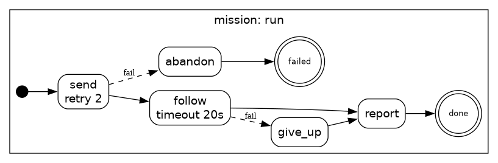
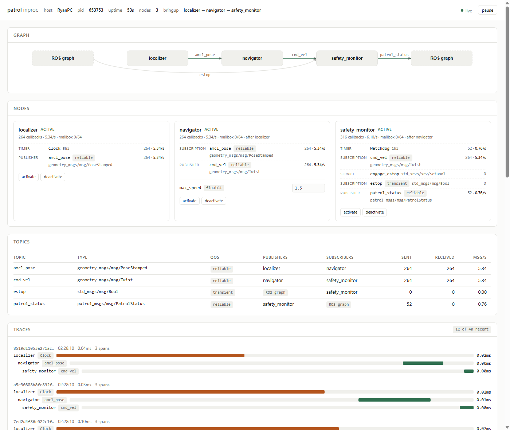
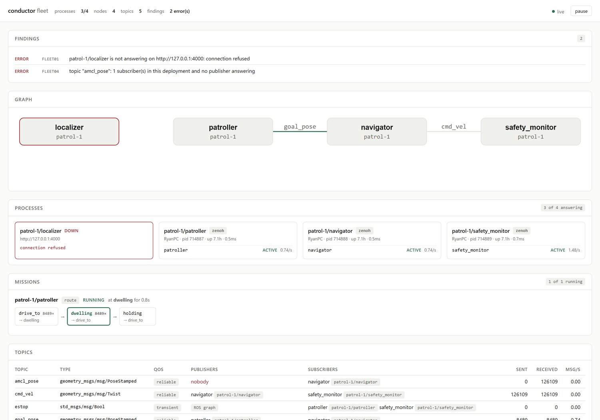

# Conductor

**Build ROS 2 applications, not ROS 2 plumbing.**

Conductor is an opinionated application framework for robotics, in Go, in the
spirit of [Encore](https://encore.dev): you declare *what your robot's nodes
do* in a small amount of typed, declarative code, and the framework derives
everything ROS 2 makes you hand-maintain — the communication graph, QoS
configuration, launch files, parameter files, lifecycle wiring, the task
state machine, the transform tree, and observability.

The core idea: **treat ROS 2 as a runtime, not a framework**, and make the
application graph a compile-time artifact. The canonical ROS failure — two
nodes silently not talking because of a QoS mismatch or a typo'd topic name,
discovered on the robot — becomes a build error.

## What it looks like

```go
//conductor:node
type Navigator struct {
    Pose     conductor.Sub[msgs.PoseStamped] `topic:"amcl_pose" qos:"reliable"`
    Cmd      conductor.Pub[msgs.Twist]       `topic:"cmd_vel"  qos:"reliable"`
    MaxSpeed conductor.Param[float64]        `name:"max_speed" default:"1.5"`
}

func (n *Navigator) OnPose(p msgs.PoseStamped) {
    // steer toward the goal; callbacks are single-threaded per node,
    // so plain struct fields are safe.
    n.Cmd.Publish(...)
}
```

```go
func main() {
    conductor.Run(&Localizer{}, &Patroller{}, &Navigator{}, &SafetyMonitor{})
}
```

From those declarations the `conductor` CLI statically derives the full topic
graph and checks it before anything runs:

```
$ conductor check examples/patrol
app patrol — 4 node(s), 5 topic(s), 3 external interface(s)
...
topics:
  amcl_pose   geometry_msgs/msg/PoseStamped   localizer -> navigator
  cmd_vel     geometry_msgs/msg/Twist         navigator -> safety_monitor,(external)
  estop       std_msgs/msg/Bool               (external) -> patroller,safety_monitor
  goal_pose   geometry_msgs/msg/PoseStamped   patroller -> navigator
  patrol_status patrol_msgs/msg/PatrolStatus  safety_monitor -> (external)

✓ graph valid: 0 errors, 0 warning(s)
```

Wiring mistakes fail the build with file:line positions:

```
error CND013: topic "battery": subscriber requests reliable delivery but
              publisher offers best-effort (app.go:26)
error CND010: topic "lidar": subscribed by monitor but nothing publishes it
error CND003: node monitor: missing handler method OnEstop (app.go:27)
```

## Try it

```sh
go test ./...                                # runtime + harness + scanner + graph tests
go run ./cmd/conductor check examples/patrol # validate the example app
go run ./cmd/conductor test examples/patrol  # validate it, then run its tests
go run ./cmd/conductor build examples/patrol # compile + emit gen/ artifacts
./examples/patrol/gen/bin/patrol             # run all nodes in-process (Ctrl-C to stop)
./examples/patrol/gen/bin/patrol -node navigator   # run a single node
```

Or through the [Makefile](Makefile), which wraps the same commands and knows
where the ROS overlay lives:

```sh
make            # list targets
make verify     # fmt + vet + tests + graph validation of every example
make check-envs # validate the example in each declared environment
make bundle     # build a deployable release bundle for the example
make interop    # the full matrix against real ROS 2 (needs .tools/env.sh)
make turtlesim  # the tutorial below, router and turtlesim_node included
```

`conductor build` emits, under `examples/patrol/gen/`:

- `patrol.launch.xml` — a ROS 2 launch file, one process per node
- `params.yaml` — ROS parameter file from the `Param` declarations; feed it
  back with `-params`, or overlay it per environment
- `graph.dot` — Graphviz view of the topic graph
- `bin/patrol` — the compiled app (one static binary; cross-compile with
  `GOOS`/`GOARCH` like any Go program)

## Concepts

| Declaration | Meaning |
|---|---|
| `//conductor:node` on a struct | The struct is a node (name: snake_case of the type) |
| `conductor.Sub[T]` + `OnField(T)` | Subscription with typed handler |
| `conductor.Pub[T]` | Publisher |
| `conductor.Param[T]` | Node parameter (`default:`, files, live `ros2 param set`) |
| `conductor.Timer` + `OnField()` | Periodic callback (`rate:"10hz"` or `rate:"250ms"`) |
| `conductor.Svc[Req,Res]` + `OnField(Req) (Res, error)` | Service server (`service:"name"`) |
| `conductor.Client[Req,Res]` + `.Call(req)` | Service client (`service:"name"`, optional `timeout:"3s"`) |
| `conductor.Action[G,F,R]` + `OnField(*Goal[G,F]) (R, error)` | Action server (`action:"name"`); handler runs one goroutine per goal |
| `conductor.ActionClient[G,F,R]` + `.SendGoal(g)` | Action client (`action:"name"`, optional `timeout:"60s"`) |
| `conductor.Mission` + `conductor.Step` + `OnField(*Task) error` | Task state machine (`start:`, `next:`, `fail:`, `timeout:`, `retry:`) |
| `conductor.TF` and `frame:"base_link"` on a Sub/Pub | Declared transform tree (`frames.json`); stamps and checks frame ids |
| `//ros:type pkg/msg/Name` on a struct | Maps a Go message type to its ROS interface |
| `conductor.json` | App name + topics provided/consumed by external ROS nodes |

QoS is expressed as intent-level profiles (`reliable`, `sensor`, `transient`)
rather than raw DDS knobs; the checker validates every pub/sub pairing.

Callbacks run on a single goroutine per node (mirroring a ROS single-threaded
executor), so node-local state needs no locking.

## Joining a live ROS 2 graph (zenoh transport)

Conductor apps can join a real ROS 2 graph as first-class peers of
`rmw_zenoh` nodes: same key expressions, CDR payloads, attachments, and
liveliness tokens, so `ros2 node list`, `ros2 topic list/info/echo` all see
conductor nodes natively — no bridge, no ROS installation linked into the
binary.

```sh
source .tools/env.sh                        # zenoh-c paths + rmw_zenoh overlay
go build -tags zenoh -o bin/patrol ./examples/patrol
./bin/patrol -transport zenoh               # connects to the router at tcp/127.0.0.1:7447
```

Verified end-to-end against ROS 2 Lyrical with rmw_zenoh 0.10:
`ros2 topic pub /chatter` → conductor subscriber, and conductor's navigator →
`ros2 topic echo /cmd_vel`, with correct type/hash/QoS shown by
`ros2 topic info --verbose`.

The transport is selected at runtime (`-transport inproc|zenoh`, plus
`-zenoh-endpoint`, `-domain`); the zenoh implementation links zenoh-c via
cgo and is gated behind the `zenoh` build tag, so plain `go build` needs no
native dependencies.

## Custom messages (`conductor msggen`)

Define interfaces as plain ROS `.msg` files and generate Go from them —
including the REP-2011 RIHS01 type hash, which conductor computes itself
(validated against all 692 message, service, and action types of a ROS 2
Lyrical install):

```sh
conductor msggen -out examples/patrol -pkg main -ros-pkg patrol_msgs examples/patrol/msg
```

emits structs with `//ros:type` directives (so `conductor check` sees them)
and `RegisterMessage` calls (so the zenoh transport can wire them). Standard
types referenced by your messages (e.g. `std_msgs/Header`) resolve via
`$AMENT_PREFIX_PATH`; `builtin_interfaces` Time/Duration map to Go
`time.Time`/`time.Duration`. Because the hash is computed locally, a custom
type needs no ROS package, no CMake, and no rebuild dance — `ros2 topic info
--verbose` on a live graph shows conductor's custom types with correct
type names and hashes.

## Services

Servers and clients are declared like everything else, with handlers that
run on the node's executor (state access is lock-free):

```go
Engage conductor.Svc[srvs.SetBoolRequest, srvs.SetBoolResponse] `service:"engage_estop"`

func (s *SafetyMonitor) OnEngage(req srvs.SetBoolRequest) (srvs.SetBoolResponse, error) { ... }
```

`conductor msggen` also parses `.srv` files — request/response structs plus
the service-level RIHS01 hash (which covers rosidl's synthesized `_Event`
type). Over zenoh, services are querier/queryable pairs in rmw_zenoh's wire
format, verified live in both directions: `ros2 service call` against a
conductor server, and a conductor `Client` calling an rclpy server. Graph
validation covers services too: a client whose service nothing serves, two
servers on one name, or a request/response type disagreement all fail
`conductor check`.

## Actions

An action server is one field and one method; conductor implements the full
ROS 2 action protocol (send_goal/cancel_goal/get_result services plus
feedback and status topics under `<name>/_action/`) on top of the transport:

```go
Fib conductor.Action[FibonacciGoal, FibonacciFeedback, FibonacciResult] `action:"fibonacci"`

func (f *FibServer) OnFib(g *conductor.Goal[FibonacciGoal, FibonacciFeedback]) (FibonacciResult, error) {
    for ... {
        select {
        case <-g.Context().Done():   // cancellation
            return partial, g.Context().Err()
        case <-time.After(step):
        }
        g.Feedback(...)
    }
    return result, nil
}
```

Handlers run on a dedicated goroutine per goal (they are long-running by
nature), with cancellation via the goal context; a non-nil error after
cancellation reports CANCELED with the partial result, otherwise ABORTED.
`conductor msggen` parses `.action` files (goal/result/feedback structs, all
derived-type hashes).

Calling an action — a conductor node driving Nav2, say — is the mirror
image:

```go
Fib conductor.ActionClient[FibonacciGoal, FibonacciFeedback, FibonacciResult] `action:"fibonacci" timeout:"60s"`

h, err := m.Fib.SendGoal(FibonacciGoal{Order: 8})   // blocks until accepted
go func() { for fb := range h.Feedback() { ... } }()
h.Cancel()                                          // optional
result, status, err := h.Result()                   // blocks until terminal
```

`SendGoal` returns `ErrGoalRejected` if the server refuses. `Result` reports
the terminal status (SUCCEEDED/CANCELED/ABORTED) alongside whatever result
the server sent, reserving `err` for transport failures. Because these calls
block, drive them from a goroutine — never directly from an executor
callback.

Both directions are covered by [`.tools/interop.sh`](.tools/interop.sh),
which runs conductor against real ROS 2 over rmw_zenoh: `ros2 service call`
and `ros2 action send_goal` into conductor servers, conductor clients into
both a conductor server and an rclpy server. See
[examples/fibonacci](examples/fibonacci/main.go) (server) and
[examples/mission](examples/mission/main.go) (client).

## Missions: task orchestration as a declaration

A robot's task layer is usually a hand-rolled state machine of booleans and
timers, or a behaviour tree in an XML file no compiler ever reads. Conductor
takes the same line it takes with topics — the machine is a declaration:

```go
//conductor:node
type Courier struct {
    Nav  conductor.ActionClient[NavGoal, NavFeedback, NavResult] `action:"navigate_to_pose"`
    Trip conductor.Mission `start:"pickup"`

    Pickup   conductor.Step `next:"transit"`
    Transit  conductor.Step `next:"dropoff" fail:"recharge" timeout:"2m" retry:"2"`
    Dropoff  conductor.Step `next:"done"`
    Recharge conductor.Step `next:"transit" backoff:"5s"`
}

func (c *Courier) OnTransit(t *conductor.Task) error {
    h, err := c.Nav.SendGoal(NavGoal{Pose: c.dropoff})
    if err != nil {
        return err                      // fail: → recharge, after 2 retries
    }
    if c.battery.Low() {
        return t.Goto("recharge")       // a branch the tags do not cover
    }
    _, _, err = h.Result()
    return err
}
```

- **The machine is checked.** A `next`/`fail` target that is not a step is a
  build error, and so is a `Goto("recharge")` written with a literal — the
  scanner reads the transitions in your code as well as the ones in the tags.
  An unreachable step is a warning. `conductor check` prints the machine and
  `conductor build` draws it in `gen/mission.dot`.
- **The runtime drives it.** A mission starts when its node reaches Active
  and is canceled when it leaves, so `ros2 lifecycle set` stops a task in
  flight. `timeout` cancels the step's context; `retry`/`backoff` re-run it;
  `fail` is the recovery branch, and `Task.Err()` tells the recovery step what
  went wrong.
- **You get the view for free.** Current step, attempts and step durations are
  metrics and spans, and the dashboard draws the machine with the live
  position on it.

Step handlers run on the mission's own goroutine — a step is long-running by
nature — so like action handlers they must not touch node state that
callbacks also use. `Task.Do(fn)` runs `fn` on the node's executor for the
cases that need to; `Task.Sleep` is the interruptible sleep.

`conductor build` draws the machine from the same declarations —
[examples/mission](examples/mission/main.go), which drives a real ROS 2 action
server through send → follow → report with a 20s branch that cancels the goal,
comes out as:



In tests, `app.AwaitMission("patroller", conductor.MissionDone, time.Second)`
waits for the machine rather than for a duration, and a step's timing can be a
parameter — `examples/patrol` runs its route with `dwell` set to 10ms under
test and 3s on the robot.

## Frames: the transform tree is declared too

Frame ids are magic strings in message headers, and the static transforms
between them live as positional arguments to `static_transform_publisher` in
a launch file. Conductor declares the tree in `frames.json`, beside
`conductor.json`:

```json
{
  "static": [
    {"parent": "base_link", "child": "laser", "xyz": [0.12, 0, 0.19], "rpy": [0, 0, 3.14159]},
    {"parent": "base_link", "child": "imu",   "xyz": [0, 0, 0.05]}
  ],
  "dynamic": [
    {"parent": "map",  "child": "odom",      "by": "amcl"},
    {"parent": "odom", "child": "base_link", "by": "ekf"}
  ]
}
```

Static links are ours: the runtime publishes them on `tf_static`, so there is
no `static_transform_publisher` to launch and nothing to keep in step with the
code. Dynamic links are someone else's — declaring them is what makes the tree
whole, so the checker can tell "that frame does not exist" from "that frame
exists, but only a transform someone publishes at runtime reaches it".

```go
//conductor:node
type SafetyMonitor struct {
    Status conductor.Pub[PatrolStatus] `topic:"patrol_status" frame:"base_link"`
    Scan   conductor.Sub[LaserScan]    `topic:"scan" frame:"laser"`
    TF     conductor.TF
}

func (s *SafetyMonitor) OnConfigure() error {
    at, err := s.TF.Lookup("base_link", "laser")   // resolved at build time too
    s.laserAhead = at.Translation[0]
    return err
}
```

- A `frame:` tag **stamps** every message the publisher sends (frame id and
  timestamp), so the frame is written once, in the declaration.
- On a subscription it **checks** them: a peer sending another frame is
  counted and named in the log, once, instead of quietly becoming a wrong
  transform later.
- `conductor check` refuses frames that are not in the tree (CND050), trees
  with two parents, a cycle or two roots (CND051–053), a `Lookup` that cannot
  be resolved from static links (CND054), a `frame:` on a message with no
  header (CND057), and warns when two endpoints of one topic declare different
  frames (CND056).
- Calibration differs from robot to robot, so an environment may name its own
  file: `"frames": "frames.robot.json"`. It ships with the release.

Verified against real ROS 2: `ros2 topic echo /tf_static` reads the tree as
`tf2_msgs/msg/TFMessage`, and `ros2 run tf2_ros tf2_echo base_link laser`
reports the declared 0.12 m offset and 180° yaw.

> Static transforms are republished at 1 Hz rather than latched, because
> transient-local durability is not implemented yet (see DESIGN.md); a late
> joiner therefore sees the tree within a second rather than instantly.

## Parameters and environments

`Param[T]` values resolve in three layers — the `default` tag, then any
parameter files, then live updates — and every node exposes the standard ROS
parameter services, so `ros2 param list/get/set/describe` works against
conductor nodes:

```sh
./patrol -transport zenoh -params params.yaml -env sim   # params.sim.yaml overlays params.yaml
ros2 param set /navigator max_speed 0.25                 # takes effect immediately
```

`conductor build` emits a `params.yaml` that is a *working* input file, not
just documentation: pass it back with `-params`, or copy it to
`params.<env>.yaml` and edit it as a per-environment overlay (sim, dev, one
per robot). Files are read in order and later ones win, and ROS's `/**`
wildcard node key is supported.

`Param.Get` is safe from any goroutine and always returns the current value,
so a `ros2 param set` is picked up by the next callback that reads it —
verified live: setting `max_speed` to 0.25 clamps the published velocity to
exactly 0.25. Type changes are refused rather than silently coerced, and
`set_parameters_atomically` really is all-or-nothing.

Parameter files use the ROS subset (`node: / ros__parameters: / key: value`),
parsed by conductor itself rather than pulling in a YAML dependency;
anything outside that shape is a clear error with a file and line.

**Environments are declared, and they are part of the graph.** What changes
between a simulator, a bench and a robot is not the application: it is who
else is on the ROS graph, which transport reaches them, and where the binary
runs. That belongs in configuration, so it lives in `environments.json` next
to `conductor.json`:

```json
{
  "default": "sim",
  "environments": {
    "sim":   {"transport": "inproc", "params": ["params.sim.yaml"],
              "without": ["engage_estop"]},
    "robot": {"transport": "zenoh", "params": ["params.robot.yaml"],
              "metrics_addr": ":9090",
              "externals": [{"topic": "scan", "type": "sensor_msgs/msg/LaserScan",
                             "role": "publisher", "qos": "sensor"}],
              "deploy": {"host": "pi@patrol-1", "goarch": "arm64",
                         "tags": ["zenoh"], "cgo": true,
                         "cc": "aarch64-linux-gnu-gcc"}}
  }
}
```

An environment's `externals` are merged over the base ones (same topic and
role replaces), and `without` drops them. Because externals are what the
graph checker uses to decide whether a subscription has a publisher, this
makes the checker environment-aware:

```sh
$ conductor check examples/patrol -env sim
app patrol [env sim] — 4 node(s), 5 topic(s), 3 external interface(s)
  warning CND021: service "engage_estop": served by safety_monitor but nothing calls it
✓ graph valid: 0 errors, 1 warning(s)

$ conductor check examples/patrol -env robot
✓ graph valid: 0 errors, 0 warning(s)
```

There is no operator console in simulation, so nothing calls the e-stop
service there — a true statement about that environment, reported at build
time instead of discovered in it. `graph`, `build` and `deploy` take `-env`
the same way.

## Lifecycle and bringup order

Every conductor node is a ROS 2 managed node: it exposes `change_state`,
`get_state`, `get_available_states`, `get_available_transitions` and the
`transition_event` topic, so `ros2 lifecycle` drives it like any other.
Nodes may implement any subset of the hooks, each running on the node's
executor:

```go
func (n *Navigator) OnConfigure() error { ... }   // also OnActivate, OnDeactivate,
func (n *Navigator) OnActivate() error  { ... }   // OnCleanup, OnShutdown
```

While a node is not active its timers stop, its publishers drop messages,
and its subscription handlers are not invoked — what the managed-node design
prescribes, enforced by the framework rather than by convention.

**The bringup order is derived, not hand-written.** Conductor knows the whole
graph, so it knows a navigator consuming `/amcl_pose` must come up after the
localizer that publishes it. `conductor check` reports the order, the
generated launch file encodes it, and `Run` follows it at startup:

```
bringup order (derived from the graph):
  localizer -> patroller -> navigator -> safety_monitor
```

Cycles are normal in robotics, so nodes in one are reported and started in
declaration order rather than treated as an error. `-lifecycle manual` skips
auto-activation entirely and waits for an external orchestrator.

## Observability

A ROS graph is a causal chain, but nothing in the ecosystem records it — so
"why did the robot stop 200 ms after that lidar frame?" is normally answered
by correlating log timestamps by hand. Conductor gives every callback a span
and **propagates trace context along the messages themselves**:

```
$ ./patrol -transport zenoh -trace
span trace=5f86…3346 span=4fd7…f8f6 parent=0000…0000 node=localizer      kind=timer        name=Clock
span trace=5f86…3346 span=4d29…28b2 parent=4fd7…f8f6 node=navigator      kind=subscription name=amcl_pose
span trace=5f86…3346 span=59e4…2b80 parent=4d29…28b2 node=safety_monitor kind=subscription name=cmd_vel
```

One trace id, correctly chained parents, across three nodes and (over zenoh)
across processes. Propagation is automatic: anything published from inside a
callback becomes a child of it. Trace context rides in an extension appended
to the rmw_zenoh attachment, after the fields rmw defines — ordinary ROS 2
nodes ignore it, verified by `ros2 topic echo` reading traced messages
unchanged. IDs are W3C trace-context, so `Span.Context.Traceparent()` feeds
OpenTelemetry directly; implement `Exporter` to ship spans anywhere.

Metrics come free too, in Prometheus format, with no user code:

```sh
./patrol -transport zenoh -metrics-addr :9095   # then curl localhost:9095/metrics
conductor_messages_published_total{node="localizer",topic="amcl_pose"} 20
conductor_callback_duration_count{node="navigator",kind="subscription",name="amcl_pose"} 20
conductor_callback_duration_sum_seconds{node="navigator",kind="subscription",name="amcl_pose"} 0.000514
conductor_node_lifecycle_state{node="navigator"} 3
```

## The dashboard

The runtime knows the graph, owns every callback, and already propagates
trace context — so it can show you the application rather than make you
reconstruct it from `ros2 topic hz` in one terminal and `ros2 param get` in
another. One flag, and the app serves its own portal:

```sh
make dashboard        # or: ./patrol -dashboard :4000 -dashboard-traces 500
```



- **The graph**, laid out in the bringup order the framework derived, with
  edges live-coloured by what is actually flowing and the ROS graph beyond
  this process drawn dashed.
- **A card per node**: lifecycle state, callbacks/s, mailbox depth and drops,
  and every declaration it wired — topic, ROS type, QoS profile, and its own
  message count and rate.
- **Parameters are editable in place.** The field goes through the same
  handle `ros2 param set` does, so type checking is identical: putting
  `quick` in a `float64` is refused with `strconv.ParseFloat: parsing
  "quick"`. So are the **lifecycle buttons** — deactivate a node from the
  browser and watch its publisher go quiet, exactly as `ros2 lifecycle set`
  would.
- **Traces as causal chains.** `-dashboard-traces N` keeps the last N spans
  in a ring buffer and the view nests them by parent, so one timer tick reads
  as `localizer/Clock → navigator/amcl_pose → safety_monitor/cmd_vel` with
  the real microsecond offsets. This is the view the trace propagation was
  built for.
- **The mission machine**, drawn as the declared chain with the running step
  marked, its attempt count and how long it has been there.
- **The transform tree**, static links (the ones this process publishes on
  `tf_static`) separated from the dynamic ones it only expects.
- **Every metric**, filterable, with per-second rates derived in the page —
  and `/metrics` still served alongside for Prometheus.

Tracing is opt-in because a span per callback is not free; without
`-dashboard-traces` everything else works and the trace panel says so. The
page is one embedded, self-contained file: no CDN, no build step, and nothing
to install next to it — which is what makes it usable over ssh to a robot on
a network with no route to the internet.

Scope is deliberately one process: in a per-node deployment each unit serves
its own dashboard, showing what that unit really has open. Merging them is
the fleet view below.

## The fleet view

A zenoh deployment is one process per node, and each of them tells the truth
about itself: its own nodes, and everything else marked `ROS graph`. That is
the picture ROS 2 already gives you, one terminal at a time. `conductor
dashboard` fans out over those processes and merges what they report:

```sh
conductor dashboard examples/patrol -env robot        # addresses from the environment
conductor dashboard -peers a=host:4000,b=host:4001    # or an ad-hoc set
```



**Nobody writes the addresses down.** The units are generated with a dashboard
port per node — the environment's `dashboard_addr` plus the node's position in
the bringup order, the same rule the metrics ports follow — so the fleet view
resolves the same addresses from the same declarations. `-host` re-points them
at an ip or a tunnel; `-peers` skips derivation entirely.

**The merge is the feature.** The union graph shows cross-process edges as
edges, and the findings are the things no single process can see:

| | |
|---|---|
| `FLEET01` | a process is not answering — and its nodes stay in the graph, greyed, so the hole is visible |
| `FLEET02/03` | a node is not Active, or its mailbox is overrunning |
| `FLEET04` | a topic has subscribers in this deployment and no publisher answering (suppressed for topics `conductor.json` declares external — a driver's topic was never ours to publish) |
| `FLEET05` | two processes disagree about a topic's type or QoS: what a half-finished deploy looks like from outside |
| `FLEET06` | two processes report different transform trees: one is running an older release, or a different calibration |

The screenshot above is the patrol app running as four zenoh processes with
the localizer killed: the view reports both the dead process *and* its
consequence — `amcl_pose` has a subscriber and nobody publishing it. Neither
is visible from any one process's dashboard, where the missing publisher just
looks like a quiet `ROS graph` edge.

It is a plain HTTP client of the per-process API (`/api/summary`, the same
state without the metric table and traces), so it runs anywhere that can
reach the robots: a laptop, or one of the robot's own processes. Nothing new
goes on the wire.

Still open, in rough order: aggregating traces across processes (the trace
context already propagates over zenoh, so a callback chain that crosses four
units is reconstructible — the fleet view just does not stitch it yet); more
than one robot per environment, which needs the fleet file
[DESIGN.md](DESIGN.md) open question 6 describes; and authentication, which
today is "your robots are on your network".

## Testing

Testing a ROS application usually means `launch_testing`: bring up real
nodes, sleep, hope. Conductor owns the wiring, so it can run your whole
application inside `go test` — real nodes, real handlers, real lifecycle, on
the in-process transport:

```go
func TestNavigatorClampsSpeed(t *testing.T) {
	app := conductortest.RunWith(t, conductortest.Options{
		Params: map[string]map[string]string{"navigator": {"max_speed": "0.25"}},
	}, &Navigator{goal: msgs.Point{X: 50, Y: 40}})

	cmd := conductortest.Watch[msgs.Twist](app, "cmd_vel")
	conductortest.Publish(app, "amcl_pose", poseAt(0, 0))

	got, _ := cmd.Last()
	if speed(got) != 0.25 {
		t.Fatalf("speed %v, want the parameter's 0.25", speed(got))
	}
}
```

No sleeps and no flakes, because the harness controls time and knows when
the graph is quiet:

- **Timers do not tick.** `app.Tick("localizer")` fires that node's timers
  once. Wall-clock timers are opt-in (`Options{RealTimers: true}`).
- **`Publish`, `Tick` and `Call` return when the work is done.** They settle
  the graph first: a barrier through every node's mailbox, repeated while
  callbacks are still causing more callbacks, so a message that crosses three
  nodes has arrived before the next line of the test runs.
- **Everything else is the real thing.** Parameters resolve from
  `Options{Params: ...}` exactly as from a file, `app.SetParam` behaves like
  `ros2 param set`, and `app.Transition(node, conductor.TransitionDeactivate)`
  gates publishers and handlers the way the lifecycle does in production.

| Helper | What it does |
|---|---|
| `conductortest.Run(t, nodes...)` | Wire and activate an app; closes on test cleanup |
| `conductortest.Publish(app, topic, msg)` | Publish as an outside node would |
| `conductortest.Watch[T](app, topic)` | Record everything published (`Len`, `All`, `Last`, `Await`) |
| `conductortest.Call[Req,Res](app, svc, req)` | Call a service the app serves |
| `app.Tick(node)` / `app.TickN(node, n)` | Fire that node's timers |
| `app.SetParam` / `app.Param` | Change and read parameters |
| `app.Transition` / `app.State` | Drive and inspect the lifecycle |
| `app.Probe(name, &struct{...})` | Attach arbitrary endpoints — an action client, say — as a test-owned node |

Action servers are driven through a probe, which is just another node the
test owns:

```go
var driver struct {
	Walk conductor.ActionClient[Goal, Feedback, Result] `action:"walk"`
}
app.Probe("driver", &driver)
h, _ := driver.Walk.SendGoal(Goal{Steps: 3})
res, status, _ := h.Result()
```

`conductor test [dir]` validates the graph first and then runs `go test` on
the app — a wiring mistake reports itself as `CND010: topic "lidar":
subscribed by monitor but nothing publishes it`, instead of as ten
behavioural tests failing for no visible reason.

The examples come with tests ([examples/patrol/patrol_test.go](examples/patrol/patrol_test.go));
`make test` runs them.

## The turtlesim tutorial, in conductor

[examples/turtlesim](examples/turtlesim/main.go) is the classic ROS 2
tutorial — drive the turtle, spawn a second one, teleport it, rotate with an
action — written as one conductor node against the real C++ `turtlesim_node`,
which knows nothing about conductor:

```go
//conductor:node
type TurtleDriver struct {
	Pose    conductor.Sub[Pose]      `topic:"turtle1/pose" qos:"sensor"`
	Cmd     conductor.Pub[Twist]     `topic:"turtle1/cmd_vel" qos:"reliable"`
	EdgeLen conductor.Param[float64] `name:"edge_length" default:"2.0"`

	Spawn    conductor.Client[SpawnRequest, SpawnResponse]       `service:"spawn" timeout:"5s"`
	SetPen   conductor.Client[SetPenRequest, SetPenResponse]     `service:"turtle1/set_pen" timeout:"5s"`
	Teleport conductor.Client[TeleportAbsoluteRequest, TeleportAbsoluteResponse] `service:"turtle2/teleport_absolute" timeout:"5s"`
	Rotate   conductor.ActionClient[RotateAbsoluteGoal, RotateAbsoluteFeedback, RotateAbsoluteResult] `action:"turtle1/rotate_absolute" timeout:"30s"`
}
```

Every interface type came from one command — no ROS build, no colcon:

```sh
conductor msggen -out examples/turtlesim -pkg main \
  geometry_msgs/msg/Twist turtlesim_msgs/msg/Pose \
  turtlesim_msgs/srv/{Spawn,SetPen,TeleportAbsolute} \
  turtlesim_msgs/action/RotateAbsolute
```

turtlesim's own endpoints are declared as externals in
[conductor.json](examples/turtlesim/conductor.json), so `conductor check`
still validates the whole graph — names, types and QoS — before anything
runs. Then:

```sh
make turtlesim   # or: ros2 run turtlesim turtlesim_node, then the example
```

```
INFO first pose from turtlesim x=5.544 y=5.544 theta=0
INFO set_pen: turtle1 now draws in red
INFO completed edge edge=1 x=7.584 y=5.544
...
INFO completed edge edge=4 x=5.509 y=5.556
INFO spawned a second turtle name=turtle2
INFO teleported turtle2 to (8, 8)
INFO rotate feedback remaining=3.136
INFO rotate finished status=SUCCEEDED delta=-3.119
INFO turtlesim tutorial complete final_theta=3.124
```

The square closes to within 0.04 of where it started because the drive loop
watches the pose topic rather than dead-reckoning, and the final heading is
π because the action ran to completion. `make interop-turtlesim` runs the
whole thing as a five-assertion regression test.

Apps like this one finish, rather than running forever: end with
`conductor.Shutdown()` (or `conductor.Abort(err)` to fail), and `Run` returns
after the lifecycle hooks and the transport have shut down. `os.Exit` would
skip that and leave stale entries on the ROS graph.

## Deployment

Shipping a ROS 2 application usually means shipping a colcon workspace and
its apt/rosdep dependency lattice. A conductor app is one static binary, and
`conductor deploy` is the rest of the story:

```sh
conductor deploy examples/patrol -env robot
```

1. validates the graph **for that environment** (a deploy of a broken graph
   is never worth attempting),
2. cross-compiles for the target (`goarch`, build tags, cgo/`cc` when the
   zenoh transport is in),
3. stages the binary, `params.yaml` plus the environment's overlays, the
   launch file, **systemd units, and a manifest**,
4. tars it, copies it over ssh, and runs the bundle's `install.sh` there.

**The units are derived from the graph, not hand-written.** The bringup order
conductor already computes becomes real systemd ordering:

```ini
# patrol-safety_monitor.service
After=network-online.target patrol-navigator.service
Wants=patrol-navigator.service
ExecStart=/opt/conductor/patrol/current/bin/patrol -node safety_monitor \
  -transport zenoh -zenoh-endpoint tcp/127.0.0.1:7447 -domain 0 \
  -params /opt/conductor/patrol/current/params.yaml \
  -params /opt/conductor/patrol/current/params.robot.yaml -metrics-addr :9091
```

Ordering only — `Wants`, never `Requires` — because a provider restarting
should not take its consumers down; the lifecycle already handles a peer that
is not up yet. Everything the process needs is on the `ExecStart` line, so
`systemctl cat` tells the whole truth about what is running.

Some consequences of knowing the graph statically:

- **The transport decides the process layout.** An `inproc` environment
  deploys as *one* unit running every node, because that bus does not leave
  the process; a zenoh environment gets one unit per node. Getting this
  wrong is invisible until the robot is silent.
- **Metrics ports are assigned, not collided.** `metrics_addr: ":9090"` with
  four nodes means `:9090` through `:9093`.
- **Mistakes are refused before the build.** An environment on the zenoh
  transport built without `-tags zenoh` is an error at deploy time, not an
  "unknown transport" exit on the robot.

Releases are versioned and switchable:

```
/opt/conductor/patrol/releases/20260728-210502/
/opt/conductor/patrol/current -> releases/20260728-210502
```

```sh
conductor deploy examples/patrol -env robot -rollback   # symlink swap + restart
conductor deploy examples/patrol -env robot -dry-run    # print what would run there
conductor deploy examples/patrol -env bench -bundle     # build the tarball only
```

The bundle is self-contained: `install.sh` is generated with the values
already in it, so an operator can copy the tarball to a robot with no network
and run it by hand. `manifest.json` records the version, git revision, build
platform, unit list, per-file checksums, and a **graph fingerprint** — a hash
of every topic, type, QoS and parameter — so "what is this robot actually
running?" has an answer that does not depend on trusting a timestamp.

`-scope user` installs `systemd --user` units under a prefix in `$HOME`,
which is how the whole path is exercised without a robot:

```
$ conductor deploy examples/patrol -env bench
installed patrol 20260728-210502 at ~/.local/share/conductor/patrol/releases/20260728-210502
restarted patrol.target

$ systemctl --user status patrol.service
● patrol.service - patrol (conductor, env bench)
     Active: active (running)
```

## Status

v1.2 — the static toolchain (scan → validate → generate) works; the runtime
executes nodes over a pluggable transport: in-process bus by default, or
Zenoh/rmw_zenoh to join a live ROS 2 graph (see above). CDR serialization is
pure Go, byte-verified against rclpy; `.msg`/`.srv`/`.action` codegen
computes RIHS01 hashes locally (validated 692/692 against a full distro).
Topics, services, and actions all work in both directions on both
transports; every node is a managed node with graph-derived bringup order;
parameters load from environment-overlaid files and update live through the
ROS parameter services; tracing and metrics are built in; and a whole
application runs inside `go test` with deterministic timers and no sleeps.
Environments are declared and the checker is environment-aware, and
`conductor deploy` cross-compiles, bundles and installs a release — with
graph-derived systemd units — over ssh, with rollback.
Task orchestration is declarative — missions are steps and tagged
transitions, checked by the same toolchain and drawn in `gen/mission.dot` —
and so is the transform tree: `frames.json` is published on `tf_static`,
composed by `TF.Lookup`, stamped into headers by a `frame:` tag, and
validated at build time. `.tools/interop.sh` checks every leg against real
ROS 2 — 27 of them, including tf2 composing our declared transforms and the
whole turtlesim tutorial. Not yet done:
transient-local latching (`tf_static` is republished instead), multi-instance
node namespacing, and sim-in-CI. See [DESIGN.md](DESIGN.md).

## Layout

- [conductor (root package)](run.go) — runtime: node wiring, executors, transport registry ([missions](mission.go), [frames](frames.go) and [tf](tf.go))
- [cmd/conductor](cmd/conductor/main.go) — CLI: `check`, `graph`, `build`, `test`, `deploy`, `msggen`
- [internal/scan](internal/scan/scan.go) — syntactic scanner for directives and declarations ([environments](internal/scan/environments.go))
- [internal/graph](internal/graph/graph.go) — topic graph construction + validation rules ([missions](internal/graph/mission.go), [frames](internal/graph/frames.go))
- [internal/gen](internal/gen/gen.go) — launch/params/dot and [systemd unit](internal/gen/systemd.go) generation
- [internal/deploy](internal/deploy/deploy.go) — cross-compile, bundle, ship, roll back
- [cdr](cdr/cdr.go) — pure-Go CDR (XCDR1-LE) codec, golden-tested against rclpy
- [transport/rmwzenoh](transport/rmwzenoh/rmwzenoh.go) — rmw_zenoh wire conventions (pure Go, golden-tested against live traffic)
- [transport/zenoh](transport/zenoh/zenoh.go) — the cgo Zenoh transport (`-tags zenoh`)
- [msgs](msgs/msgs.go) — hand-written common ROS message types + registered type hashes
- [conductortest](conductortest/conductortest.go) — run an application inside `go test`
- [examples/patrol](examples/patrol/nodes.go) — example application: a mission-driven route, declared [frames](examples/patrol/frames.json), [environments](examples/patrol/environments.json) (with [tests](examples/patrol/patrol_test.go))
- [examples/chatter](examples/chatter/main.go) — minimal ROS-interop example
- [examples/mission](examples/mission/main.go) — a declared mission driving a ROS 2 action server
- [examples/turtlesim](examples/turtlesim/main.go) — the ROS 2 turtlesim tutorial, in conductor
